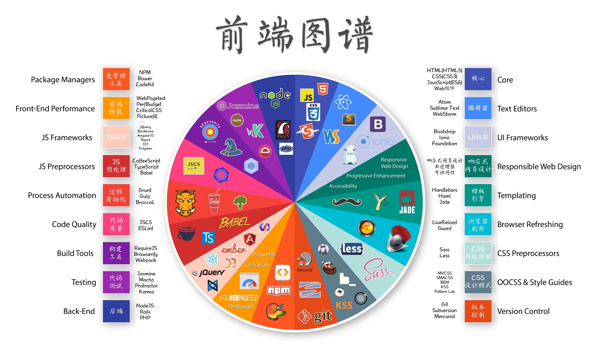
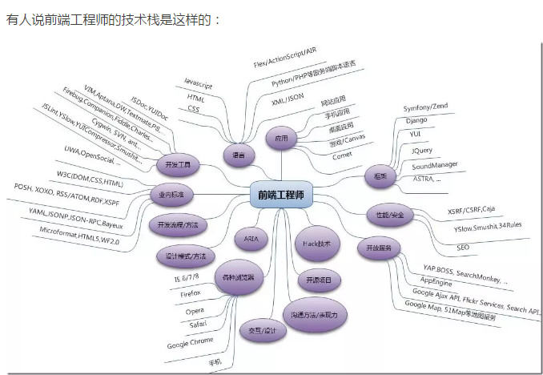

# 2017计划

## 任务计划

- vue、、pc组件：（elementui、muse-ui、vue material、iview、vuetify、radon-ui、vue-antd、keen-ui、[atui](https://github.com/aliqin/atui)）

  移动端组件：（vue-admin、vux、vonic、vue-mui、mintui、vue-weui、N3-components、vum、[vue-blu](https://github.com/chenz24/vue-blu)）、服务端渲染（nuxt.js）、模板引擎（vue模板引擎）

  - OnsenUI  Mobile app development framework and SDK using HTML5 and JavaScript. Create beautiful and performant cross-platform mobile apps. Based on Web Components, and provides bindings for Angular 1, 2, React and Vue.js.

- js基础（面向对象的程序设计、函数表达式、dom、事件、Ajax和comet、离线应用与客户端存储）、typescript、sass（，less，stylus，postcss）、手机适配

- node（fs、path、process、buffer、events、stream、child process、http、assert、cluster、os、net和dns）、expresss（koa，pm2，forever）、mongodb（nedb、rxdb、lowdb）、mocha

- webpack

- http基础、ajax（async.js、promises、generators、async functions）、（websocket，comet，轮询）、跨域

- 博客、前后端系统、造数工具、组件库、页面自动生成平台、用electron写开发者平台、用pwa写开发者平台

- 小程序、weex、pwa、electron、react、react native、web worker (service worker)

- docker（微服务 springboot）、ngnix

- php、yii2、laravel

## 优先级

```
blog(youngwind)  梁少锋的vue源码分析
nuxt.js、vue-hackernews-2.0、重写vue-admin、vue-auth、简单的vue组件初始开发、
造数工具（导出，图形化界面）
简历（mui手机版，服务端java maven和vue电脑版，服务端node参照mmf-blog）
数据工坊mui改成前端项目
vue组件开发
php、laravel
postcss/手淘高清方案源码分析
vue代码继续写并读源码(nuxt.js/组件库)
nodejs
小程序入门
nginx
web安全学习
```

## 问题

```
后端java+前端vue  之间通信要如何处理(直接把生成的vue放到java工程中运行)
后端java+前端vue 如果有用到webpack的require.ensure会不会影响工程的使用(require.ensure只是把对应的模块分块打包，主块和副块之间有依赖关系)
后端java+前端vue+node 如果用到服务端渲染，nodejs和vue和java之间要怎么通信(vue的服务端渲染是在node环境中执行的，node环境必须存在，至于怎么和java合目前没有思路，大部分的思路是把node当做中间件，用node做服务端渲染，取的数据调java工程生成的数据)
前端vue+node+mongodb 纯js的工程怎么玩转？
前端vue  是否可以用node的api(不行，浏览器不能运行node，因此不能在前端使用node的api。起初误认为前端有使用require，后才想到用的是es6的import，如果要用require，要用browserify模拟commonjs)
```

## vue-demo

```
blog(youngwind)  梁少锋的vue源码分析
高 CMS-of-Blog 支持md、vue2
中 jackblog-vue 各个版本都有，用了个别组件
vue-2.0-FamilyBucket：支持jq
高 vue2-auth：DD案例
高 vueAdmin：element组件
vue-cli-multi-page：vue-cli多页
vue-pack
vue-cnodejs：cnode社区
高 vue2-elm：饿了么（vue-sell）
高 vue-tutorial
vue-zhihu-daily：在线知乎 手机端
zhihu-daily-vue： 知乎vue2
vue-ssr-starter-kit、vue-ssr
vueWebapp 移动端H5积分商城（vue1/vue-router/）
vue-spa-template vue.js 单页应用项目模板
example-vue2
vue-sui-demo 移动端demo sui-mobile
vue2-flex flex布局设置
vue-mobile-qq 一个长得像qq的demo
vue-wechat vue开发微信app
mmf-blog-vue2-ssr
vue-blog
web-dojo vue2服务端渲染登陆页
vue-multipage 多页脚手架
pagekit  cms系统
swoole-vue-webim  聊天工具
vue-express-mongodb  前后端分离
vueBlog  前后端分离blog
doubanMovie
doubanMovie-SSR
mi-by-vue  模仿小米官网
```

## 最新新起的前端框架

```
mithril.js   A Javascript Framework for Building Brilliant Applications (development repo)
svelte  The magical disappearing UI framework
inferno  An extremely fast, React-like JavaScript library for building modern user interfaces
meteor  Meteor, the JavaScript App Platform 是一组新的技术用于构建高质量的web应用，提供很多现成的包，可直接在浏览器或者云平台中运行
ember.js  Ember是一个雄心勃勃的web应用程序，消除了样板，并提供了一个标准的应用程序架构的javascript框架
polymer  Build modern apps using web components
riot  Simple and elegant component-based UI library
```

## 有趣的开源包

```
{ejs、artTemplate、nunjucks、handlebars.js（hbs）、pug（jade）[建议不适用，不利于前后端分离，更适合服务端渲染]、vue自带模板引擎、mustache.js、jsrender、dustjs、hogan.js、Juicer、tmodjs、Markup.js、fxtpl}  模板引擎
vuex-router-sync 使vue-router和vuex同步
vue-color 选色板
vue-infinite-scroll 无限滚动
vue-lazyload 懒加载
vue-calendar 日期控件
vue-strap
vue-fullcalendar 完整日历组件
vue-html5-editor 简单的html5编辑框
vue-axios vue版本的axios
vue-validator 验证
vue-echarts  基于vue的echarts
vue-strap 基于vuejs和bootstrap.css的基本组件
vue-decorators  Decorators for VueJS
vue-flatpickr  Flatpickr for VueJS
vue-occupy  A Vue directive for occupying content places before the data has been loaded
vue-trend  曲线图
vue-head  head头部封装
Vue-Socket.io  websocket.io vue版本
vue-meta  meta头部封装
vue-desktop A UI library for building admin panel website.
vue-kit  base on vue-webpack template(vue 2.x and vue-router 2.x), with bulma, chart.js, font awesome, Weui. Aims to be a quick start for building demo applications or product prototypes.
vue-waterfall  vue版瀑布流
Vueditor  vue编辑框
nuxt-helpers  ssr by nuxt.js
node-interview  如何通过饿了么的node面试
markcook A smart and beautiful markdown editor
json-server 模拟服务端json(Mock.js)
dreamjs  A lightweight json data generator.
faker.js  generate massive amounts of fake data in Node.js and the browser
node-inspector node debug
ui/artDialog 一个弹出框组件库
bounce.js 拖动动画
wangEditor-mobile/wangEditor 富文本框
lebab/babel es5->es6/es6->es5
Awesome_API api集合
PhotoSwipe
nprogress 浏览器上的横向加载条
bootstrap-select 下拉选择框
marked markdown
DSinJS 数据结构与算法 js
iscroll 滚动条
immutable-js 提高持久数据集合的效率 如map、set
amazeui 手机端组件框架
hammer.js multi-touch gestures
Hilo alibaba 游戏解决方案
tmallfe.github.io 天猫前端
flexboxgrid flex布局
director 和jq绝配的路由
stateman、pathjs、fd-router 路由
history.js 路由
bluebird promise lib
DDFE-blog 滴滴博客
ssi-uploader 上传图片、文件
pulltorefresh.js 下拉刷新
calendar-heatmap d3.js Heatmap 类似于github的贡献度表格
layer 丰富多样的Web弹出层组件
matter-js a 2D rigid body physics engine for the web
pushy 一个侧边栏弹出菜单
postcss-salad 沙拉是一个能够帮助你写出更加简洁、优雅的CSS的样式解决方案
digitRoll 数字滚动效果
RxJS
AlloyTouch 阿里出的触屏事件（2D,3D等）
AlloyFinger
mobileTech 介绍了手机端web应用开发的工具和注意点
parallax.js 1.触摸或鼠标滚轮逐帧动画 2.分频动画  还有一个是简单的视差滚动效果（jq插件）  同名工程
juicer 一个命令行工具，js、css
jQuery-File-Upload 文件上传小工具
slideout 手机webapp的侧边栏效果
sugar 一个搭建webui组建的js mvvm库
select2 一个基于jq的选择框，支持搜索，移除数据，无限加载数据
node-jscs js代码检查
forever 一个脚本启动cli（pm2）
material-design-lite ？
avalon.oniui 基于avalon的组件
avalon-webpack-spa 一个集成avalon的工程项目
polyfill
core-js js的标准核心库封装
multi-picker 移动端联动选择器
flv.js、video.js 视频播放器
hexo 一个简单的blog框架 nodejs
axios promise 基础的客户端http请求
quasar Build responsive websites and hybrid mobile Apps (that look native!) using same code, with VueJs 2.
velocity.js
animate.css 跨平台css动画效果
shadowsocks-windows
basket.js 从localstorage中获取文件
phantomjs
ssrem sublime插件css值->rem
mui
SUI-Mobile
lodash 
How-To-Ask-Questions-The-Smart-Way 本文原文由知名 Hacker Eric S. Raymond 所撰寫，教你如何正確的提出技術問題並獲得你滿意的答案
gold-miner 掘金翻译计划，翻译掘金上优质的英文文章
awesome-webpack-cn webpack优秀中文文章
esprima 用于ecmascript语法分析和语义分析
acorn js语法解析
node-http-proxy an HTTP programmable proxying library that supports websockets
cool-head 完整的meta头部写法
lionbars A free to use, lightweight jQuery plugin that makes scrollbars look like in OSX Lion.（jq）
grumble.js 提示冒泡文字（jq）
Kwicks 弹性SlideShow（jq）
isotope 瀑布流（jq）
fancyBox LightBox（jq）
kendo-ui-core An HTML5, jQuery-based widget library for building modern web apps（jq）
noty 提示区域 & 提示层 noty is a jQuery notification plugin that makes it easy to create alert - success - error - warning - information - confirmation messages as an alternative the standard alert dialog（jq）
jQuery-Knob 旋转进度（jq）
node-sass-example 使用node-sass-middleware及node-sass的例子
JSON-js JSON in JavaScript
{
    react系列
    reduxDevTools Redux DevTools应用
}
ejsExcel nodejs excel template engine. node export excel
express-ejs-layouts Layout support for ejs in express.
ejs(koajs) a koa view render middleware, support all feature of ejs
mocha 前端测试工具
{mocha搭配的异常提示模块
    should.js  BDD style assertions for node.js -- test framework agnostic
    better-assert  c-style assert() for nodejs, reporting the expression string as the error message
    expect.js  Minimalistic BDD-style assertions for Node.JS and the browser.
    unexpected  The extensible BDD assertion toolkit 
    chai（集成了以上的所有用例执行方式） BDD / TDD assertion framework for node.js and the browser that can be paired with any testing framework. 
}
lowdb  lowdb is a small local JSON database powered by lodash (supports Node, the browser and Electron)
nedb  The JavaScript Database, for Node.js, nw.js, electron and the browser
phantomjs 
gibon  Functional client-side router in ~570 bytes, built on HTML5 History API.
snabbdom  A virtual DOM library with focus on simplicity, modularity, powerful features and performance.
the-super-tiny-compiler  Possibly the smallest compiler ever
escodegen  ECMAScript code generator
cropperjs  JavaScript image cropper
viewerjs  JavaScript image viewer.
datepicker（fengyuanchen）  A simple jQuery datepicker plugin.
Clusterize.js  Tiny vanilla JS plugin to display large data sets easily
Web-Font-Load  Install all Google Web Fonts onto your local machine
angular-cli  CLI tool for Angular
TypeScript（zhongsp） ts教程
typescript-book  ts教程
three.js  JavaScript 3D library.
awesome-gis  gis相关资源
awesome-express  Express 好用的中间件、新闻资讯、网站收集
docker  Docker - the open-source application container engine
docker_practice  学习和理解docker
logspout  Log routing for Docker container logs
es6-promise  A polyfill for ES6-style Promises
es6-promisify  Convert callback-based javascript to ES6 Promises
co  The ultimate generator based flow-control goodness for nodejs (supports thunks, promises, etc)
jekyll/middleman/metalsmith(Ruby)  静态网站生成器(SSG)。SSG生成的完全缓存的网站不仅安全，而且易扩展。
GraphicsJS  一个轻量级的前端图形库
Snap.svg  The JavaScript library for modern SVG graphics. 
Bonsaijs  BonsaiJS is a graphics library and renderer
egg  Born to build better enterprise frameworks and apps with Node.js & koa
ez-progress  一个web（伪）进度插件
scrat  Webapp Modular Framework
postcss-modules-example  postcss gulp ejs demo
postcss-modules  postcss的完整例子
css-modules  Documentation about css-modules
awesome-css  css相关内容的收集
awesome-express 主要是收集 Express 好用的中间件、新闻资讯、网站
awesome-koa  Awesome Koa.js Web Framework
officegen  office2007及以后生成工具
electron-sample-apps  electron例子开发
awesome-electron  electron相关知识
electronic-wechat  用electron开发的微信
awesome-pwa  pwa相关知识 
Awsome-Front-End-learning-resource  GitHub最全的前端资源汇总仓库（包括前端学习、开发资源、求职面试等） 
Front-end-Web-Development-Interview-Question  前端面试大集
FE-interview 前端面试大集
Front-end-Interview-questions 前端面试大集
awesome-interview-questions 所有技术的面试集合
RegexHub  正则表达式
cssicon   纯css写的icon图标
flatpickr  原生js编写的日历控件
nativefier  Make any web page a desktop application
commander.js  node.js command-line interfaces made easy
PubSubJS  Dependency free publish/subscribe for JavaScript
bulma  Modern CSS framework based on Flexbox
Chart.js  使用canvas元素实现简单的html5图表
my-git 有关 git 的学习资料
rasterizeHTML.js  Renders HTML into the browser's canvas
MarkdownIME  A fresh way to write well-formatted text, by typing markdownized stuff on web
log4js-node  A port of log4js to node.js
Sortable  Sortable — is a JavaScript library for reorderable drag-and-drop lists on modern browsers and touch devices. 
matchMedia.js  matchMedia polyfill for testing media queries in JS
ggraph  图形可视化的凌乱数据
medium-editor  WYSIWYG编辑器的克隆，使用可改写的API来实现富文本解决方案
moment  Parse, validate, manipulate, and display dates in javascript. 
clipboard.js  现代拷贝到剪贴板。无flash。只有3kb gzipped
impress.js  一个基于现代浏览器中CSS3变换和转换特性的展示框架
sweetalert2  js alert的一个强大替代
ace  一个用js编写的独立代码编辑器
dragula  很简便实现拖放功能
hyper  基于web技术的终端。采用html，css&js技术开发
webtorrent  浏览器中streaming torrent客户端
docsify  一个神奇的文档站点生成器
enzyme  一个用于react的js测试工具，可以更容易地断言，操作和遍历react组件的输出。enzyme的api通过模仿jquery api来操纵和遍历dom。
sigma.js  专用于图形绘制的js库
eme  一个优雅的md编辑器
async  一个使用Node模块，提供了直接的，强大的功能来处理异步js，虽然最初设计为使用Node.js可以通过npm install --save async安装，但也可以直接在浏览器中施一公
mongotron  一个使用electron和angular js构建的mongodb gui
AR.js  Efficient Augmented Reality for the Web using ARToolKit - 60fps on mobile!
fabric.js  一个让开发人员能够使用html5 canvas元素的框架，是一个在canvas元素上的交互式对象模型。也是一个svg-to-canvas解析器
socket.io  实时应用程序框架
Ghost  一个简单，强大的发布平台
wintersmith  一个简单而灵活的静态站点生成器。它使用插件转换（md，less，script等）内容，然后输出一个静态网站（html，css，图像等），可以托管在任何地方。
countly-server  基于插件的实时移动，web和桌面分析平台，具有超过10个不同的sdk。countly还包括针对移动设备的大量推送通知和崩溃报告服务。
strider  持续部署/持续集成平台。采用node.js/js编写的，并且使用mongodb作为后台存储
fullPage.js  jquery插件，创建全屏滚动网站（单页网站）。允许创建全屏滚动网站，以及在网站的部分中添加一些横向滑块
propeller  一个基于bootstrap和google`s material design语言的css组件框架。
baguetteBox.js  一个简单易用的js lightbox库
whitestorm.js  使用three.js
animatelo  极度流行的animate.css库的端口，它用web animations api克隆替代css转换。所有原始的animate.css效果都被重建，但现在的api是基于js类而不是css类，该库轻量且不依赖jq，在旧版浏览器要求polyfill
yargs  通过使用node.js构建功能全面的命令行应用，能轻松配置命令，解析多个参数，并设置快捷方式等，还能自动生成帮助菜单
webgradients  多种漂亮的渐变色。直接复制css到项目中就可以使用
sticky-kit  jq插件，允许在页面附加元素，设置跟随滚动的侧边栏效果
scrolldir  超轻量的js库，用以检查滚动条的移动，并根据选择的元素切换 上/下 数据属性。平滑的用户体验
svgo  用以优化svg文件的nodejs工具，将他们从非必要的信息中剥离出来
store.js  一个跨浏览器的用于高级本地存储的解决方案，实现了浏览器的本地存储的js封装api，不是通过cookie和flash技术实现，而是使用localstorage，globalstorage和userdata行为
snarkdown  是一个用js编写的极简的md解析器。功能不是最健全，但可能是最容易实现的一款解析器
unfetch  让开发者更好地处理异步请求，他能在大多数浏览器上受支持，但fetch()方法在ie浏览器中仍不可用
kissui.scrollanim  使用css3+js实现的用于创建滚动动画的库，应用在元素上后，当此元素出现在浏览器可视区域时便会执行对应的动画。使用scrollanim时需要用到kissui.css
neurojs  用于在浏览器中进行深度学习js框架，可以通过强化学习进行全栈神经网络
handsontable、SlickGrid(配置和学习难度较高)、ag grid、jQuery-KingTable（jq）、w2ui(jq)、
bootstrap-waterfall  瀑布流布局
waterfall.js（raphamorim） 瀑布流布局
url-search-params  Simple polyfill for URLSearchParams standard
create-react-native-app  为开发者快速创建零配置的react native项目。
flex-cheatsheet  提供了交互式的css flexbox教程，介绍了flexbox的使用语法与经典案例
awesome-github-vue  vue开源项目汇总
omi  开放现代的Web组件化框架
Mars  腾讯移动Web前端知识库
fetch  A window.fetch JavaScript polyfill.
localForage  Offline storage, improved. Wraps IndexedDB, WebSQL, or localStorage using a simple but powerful API.
hypernova  A service for server-side rendering your JavaScript views
jsoup  jsoup: Java HTML Parser, with best of DOM, CSS, and jquery
passport  Simple, unobtrusive authentication for Node.js.
everyauth  也是登录认证
consolidate.js 模板引擎汇总
egg.js  A simple javascript library to add easter eggs to web pages.
jPages  jq分页
awesome-wechat-weapp  微信小程序开发资源汇总
awesome-github-wechat-weapp  微信小程序开元项目汇总
awesome-weex  weex开发资源汇总
simplemde-markdown-editor  md编辑框
koa-grace  基于koa的标准前后端分离框架
mini-toastr   不依赖于任何库的roastr组件
quill  text editor工具
fine-uploader   多功能uploader组件
onepage-scroll  Create an Apple-like one page scroller website (iPhone 5S website) with One Page Scroll plugin
in-view  进入屏幕视野内的元素会发生变化
lightgallery.js  图片、视频画廊
bamei  简易node开发框架
bulma  Modern CSS framework based on Flexbox
lib-flexible  手淘伸缩可适配方案
px2rem  px转rem工具
pills  A simple responsive CSS Grid for humans
grd  A CSS grid framework using Flexbox. 
```

## 2017-2018前端

>会变成多端的生态：跨web，pwa 也是 多端的生态方案之一
>
>所有 js , css 会非常依赖 脚手架、框架上的协助（如： vue-cli, react-cli, ng-cli 等）;不用，你的生产力，其实是落后别人很多的，大神都在做有生产力的框架
>
>社群的力量大于书本、视频、培训班。（请多多分享）

## vue-cli默认配置

vue-cli 默认配置

    css: generateLoaders(['css']),
    postcss: generateLoaders(['css']),
    less: generateLoaders(['css', 'less']),
    sass: generateLoaders(['css', 'sass?indentedSyntax']),
    scss: generateLoaders(['css', 'sass']),
    stylus: generateLoaders(['css', 'stylus']),
    styl: generateLoaders(['css', 'stylus'])
不过默认都没有安装依赖

## 阮一峰超级教材

1.导论

	概述
	JavaScript的历史
2.语法
	基本语法
	数据类型
	数值
	字符串
	对象
	数组
	函数
	运算符
	数据类型转换
	错误处理机制
	编程风格
3.标准库
	Object对象
	Array对象
	包装对象和Boolean对象
	Number对象
	String对象
	Math对象
	Date对象
	RegExp对象
	JSON对象
	console对象
	属性描述对象
4.面向对象编程
	概述
	this 关键字
	prototype 对象
	Object 对象与继承
	面向对象编程的模式
5.语法专题
	单线程模型
	定时器
	Promise
	严格模式
6.DOM模型
	概述
	Document节点
	Element节点
	属性的操作
	Text节点和DocumentFragment节点
	事件模型
	事件类型
	CSS操作
	Mutation Observer
7.浏览器环境
	概述
	window对象
	History对象
	Cookie
	Web Storage：浏览器端数据储存机制
	同源政策
	Ajax
	CORS
	IndexedDB：浏览器端数据库
	Web Notification API
	Performance API
	移动设备API
8.HTML网页的API
	概述
	Canvas
	SVG图像
	表单
	文件与二进制数据的操作
	Web Worker
	SSE：服务器发送事件
	Page Visiblity
	FullScreen API：全屏操作
	Web Speech
	requestAnimationFrame
	WebSocket
	WebRTC
	Web Components
9.废稿
	Underscore.js
	Modernizr
	Datejs
	D3.js
	设计模式
	排序算法
	PhantomJS
	Bower：客户端库管理工具
	Grunt：任务自动管理工具
	RequireJS和AMD规范
	Lint工具
	MVC模式和Backbone.js
	Gulp：任务自动管理工具
	Browserify：浏览器加载Node.js模块
	JavaScript 测试
	Source map
	有限状态机
10.草稿：jQuery
	概述
	工具方法
	插件开发
	deferred对象
	如何做到jQuery-free？
11.草稿：Node.js
	概述
	Module
	package.json文件
	npm模块管理器
	fs模块
	path模块
	process对象
	Buffer对象
	Events模块
	Stream接口
	Child Process模块
	Http模块
	assert模块
	Cluster模块
	OS模块
	Net模块和DNS模块
	Express框架
	Koa框架
## vue官网知识网

[vue链接](https://vuefe.cn/v2/guide/)

### 基础

1. 介绍

   ```
   Vue.js是什么
   起步
   声明式渲染
   条件与循环
   处理用户输入
   用组件构建（应用）
   与自定义元素的关系
   准备好探索更广阔的世界了？
   ```

2. Vue实例

   ```
   构造器
   属性与方法
   实例生命周期
   生命周期图示
   ```

3. 模板语法

   ```
   插值
   	文本
   	纯HTML
   	属性
   	使用Javascript表达式
   指令
   	参数
   	修饰符
   过滤器
   缩写
   	v-bind缩写
   	v-on缩写
   ```

4. 计算属性

   ```计算属性
   计算属性
   	基础例子
   	计算缓存vsMethods
   	计算属性vsWatched Property
   	计算setter
   观察 Watchers
   ```

5. Class与style绑定

   ```
   绑定HTML Class
   	对象语法
   	数组语法
   	用在组件上
   绑定内联样式
   	对象语法
   	数组语法
   	自动添加前缀
   ```

6. 条件渲染

   ```
   v-if
   	<template>中v-if条件组
   	v-else
   	v-else-if
   	使用key控制元素的可重用
   v-show
   v-if vs v-show
   v-if with v-for
   ```

7. 列表渲染

   ```
   v-for
   	基本用法
   	Template v-for
   	对象v-for
   	范围v-for
   	组件和v-for
   	v-for with v-if
   key
   数组更新检测
   	变异方法
   	重塑数组
   	注意事项
   显示过滤/排序结果
   ```

8. 事件处理器

   ```
   监听事件
   方法事件处理器
   内联处理器方法
   事件修饰符
   按键修饰符
   为什么在HTML中监听事件？
   ```

9. 表单控件绑定

   ```
   基础用法
   	文本
   	多行文本
   	复选框
   	单选按钮
   	选择列表
   绑定value
   	复选框
   	单选按钮
   	选择列表设置
   修饰符
   	.lazy
   	.number
   	.trim
   在组建中使用v-model
   ```

10. 组件

 ```
 什么是组件？
 使用组件
 	注册
 	局部注册
 	DOM模板解析说明
 	data必须是函数
 	构成组件
 Prop
 	使用Proo传递数据
 	camelCase vs kebab-case
 	动态Prop
 	字面量语法 vs 动态语法
 	单向数据流
 	Prop验证
 自定义事件
 	使用v-on绑定自定义事件
 	使用自定义事件的表单输入组件
 	非父子组件通信
 使用Slot分发内容
 	编译作用域
 	单个Slot
 	具名Slot
 	作用域插槽
 动态组件
 	keep-alive
 杂项
 	编写可复用组件
 	子组件索引
 	异步组件
 	组件命名约定
 	递归组件
 	组件之间的循环引用
 	内联模板
 	X-Template
 	使用v-once的低开销静态组件
 ```

### 进阶

1. 深入响应式原理

   ```
   如何追踪变化
   变化检测问题
   声明响应式属性
   异步更新队列
   ```

2. 过渡效果

   ```
   概述
   单元素/组件的过渡
   	过渡的-CSS-类名
   	CSS过渡
   	CSS动画
   	自定义过渡类名
   	同时使用Transitions 和Animations
   	Javascript钩子
   初始渲染的过渡
   多个元素的过渡
   	过渡模式
   多个组件的过渡
   列表过渡
   	列表的进入和离开过渡
   	列表的位移过渡
   	列表的渐进过渡
   可复用的过渡
   动态过渡
   ```

3. 过渡状态

4. Render函数

   ```
   基础
   createElement参数
   	完整数据对象
   	完整示例
   	约束
   使用Javascript代替模板功能
   	v-if and v-for
   	v-model
   	Event & Key Modifiers
   	Slots
   JSX
   函数化组件
   	slots() 和 children 对比
   模板编译
   ```

5. 自定义指令

   ```
   简介
   钩子函数
   钩子函数参数
   函数简写
   对象字面量
   ```

6. 混合

   ```
   基础
   选项合并
   全局混合
   自定义选项混合策略
   ```

7. 插件

   ```
   开发插件
   使用插件
   ```

8. 单文件组件

   ```
   介绍
   起步
   	针对刚接触JavaScript模块开发系统的用户
   	针对高级用户
   ```

9. 生产环境部署

   ```
   删除警告
   	Webpack
   	With Build Tools
   	Browserify
   	Rollup
   预编译模板
   提取组件CSS
   跟踪运行时错误
   ```

10. 路由

 ```
 官方路由
 从零开始简单的路由
 整合第三方路由
 ```

11. 状态管理

    ```
    类Flux状态管理的官方实现
    	React的开发者请参考以下信息
    简单状态管理起步使用
    ```

12. 单元测试

    ```
    配置和工具
    简单的断言
    编写可被测试的组件
    断言异步更新
    ```

13. 服务端渲染

    ```
    需要服务端渲染（SSR）吗？
    	SEO（搜索引擎优化）
    	客户端的网络比较慢
    	客户端运行在老的（或者直接没有）JavaCript引擎上
    	服务端渲染 对比 预渲染
    Hello World
    通过Express Web服务器实现简单的服务端渲染
    流式响应
    组件缓存
    	设置
    	缓存的理想组件
    构建过程、路由、和Vuex状态管理
    Nuxt.js
    ```

14. TypeScript Support

    ```
    官方的声明文件
    	编译选项
    	访问Vue的类型声明
    类-样式Vue组件
    ```

## 前端图谱




