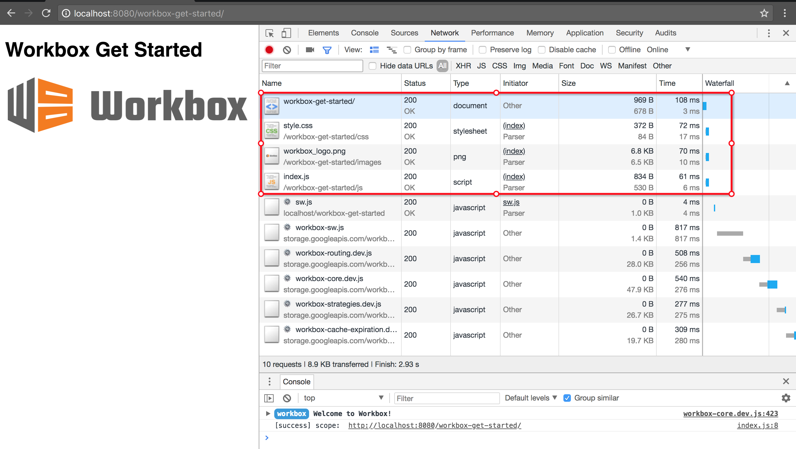
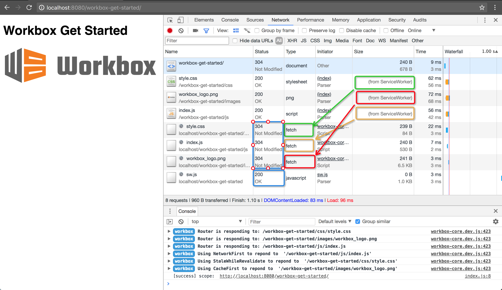
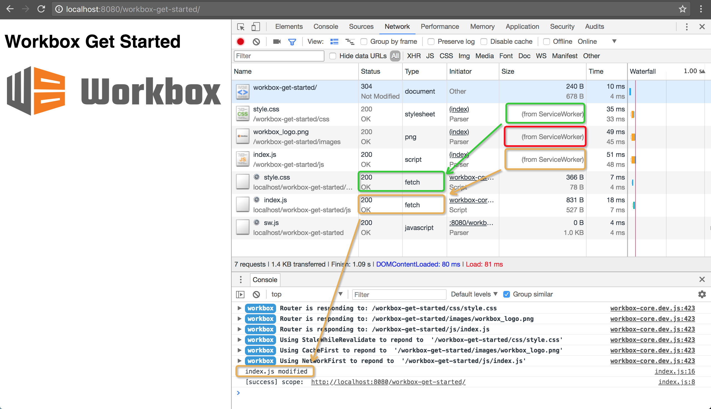
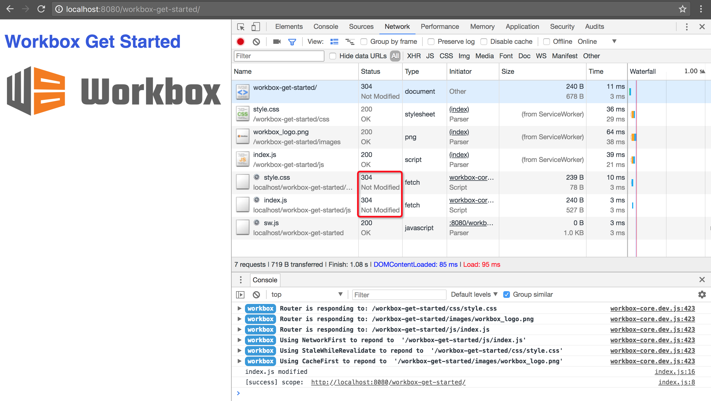
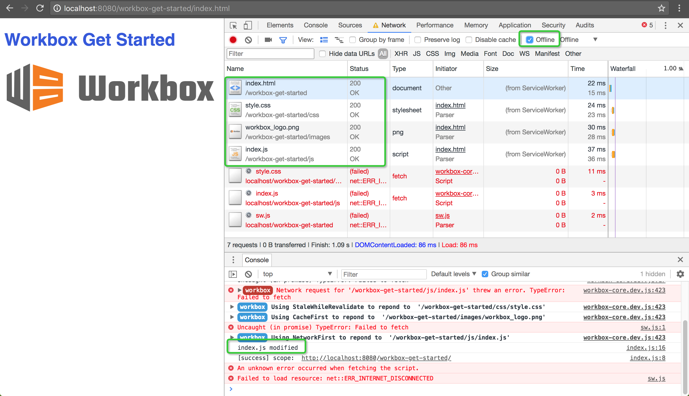

## 什么是PWA

Progressive Web App，简称PWA，是提升Web App的体验的一种新方法，能给用户原生应用的体验。

PWA能做到原生应用的体验不是靠特指某一项技术，而是经过应用一些新技术进行改进，在安全、性能和体验三个方面都有很大提升，PWA本质上是Web App，借助一些新技术具备了Native App的一些特性，兼具Web App和Native App的优点。

特点：

- **可靠**-即使在不稳定的网络环境下，也能瞬间加载并展现
- **体验**-快速响应了，并且有平滑的动画响应用户的操作
- **粘性**-像设备上的原生应用，具有沉浸式的用户体验，用户可以添加到桌面

### 离线和缓存

#### Service Worker

##### 前提条件

- Service Worker**要求HTTPS的环境**，通常可以借助github page进行学习调试。或者用**localhost、127.0.0.1**浏览器也允许调试Service Worker
- Service Worker的**缓存机制**依赖于**Cache API**实现
- 依赖HTML5 **fetch API**
- 依赖**Promise**实现

##### 注册

要安装Service Worker，需要通过在js主线程（常规的页面里的js）注册Service Worker来启动安装，这个过程会通知浏览器Service Worker线程的javaScript文件在什么地方呆着

```
if ('serviceWorker' in navigation) {
    window.addEventListener('load', function() {
        navigation.serviceWorker.register('/sw.js', {scope: '/'}).then(function(registration) {
            // 注册成功
            console.log('ServiceWorker registration successful with scope:' + registration.scope);
        }).catch(function(err) {
            // 注册失败
            console.log('ServiceWorker registration failed:' + err);
        });
    });
}
```

- 首先要判断ServiceWorker API在浏览器中是否可用，支持的话才继续实现
- 接下来在页面onload的时候注册位于./sw.js的Service Worker
- 每次页面加载成功后，就会调用register()方法，浏览器将会判断ServiceWorker线程是否已注册并作出相应的处理
- register方法的scope参数是可选的，用于指定让Service Worker控制的内容的子目录。以上demo服务工作线程文件位于根网域，意味着服务工作线程的作用域将是整个来源
- 说明register方法的**scope参数**：**ServiceWorker线程将接收scope指定网域目录上所有事项的fetch事件**，如果我们的ServiceWorker的JavaScript文件在/a/b/sw.js，不传scope值的情况下，scope的值就是/a/b
- scope的值得意义在于如果scope的值为/a/b，那么ServiceWorker线程只能捕获到path为/a/b开头的（/a/b/page1，/a/b/page2，…）页面的fetch事件。通过scope的意义也能看出ServiceWorker不是服务单个页面的，所以在ServiceWorker的js逻辑中全局变量需要慎用
- then()函数链式调用promise，当promise resolve的时候，里面的代码就会执行
- 最后链了一个catch()函数，当promise rejected才会执行

代码执行完成之后，就注册了一个Service Worker，它工作在worker context，所以**没有访问DOM的权限**。在正常的页面之外运行Service Worker的代码来控制他们的加载。

##### 查看是否注册成功

可以用[service-worker-inspect](chrome://inspect/#service-workers)

还可以通过[service-worker-internals](chrome://serviceworker-internals)来查看服务工作线程详情。如果只是很想了解服务工作线程的生命周期，这很有用，但很有可能被上者取代

##### 注册失败的原因

- 不是HTTPS环境，不是localhost或127.0.0.1
- Service Worker文件的地址没有写对，需要相对于origin
- Service Worker文件在不同的origin下而不是你的APP的，是不被允许的

##### 安装

注册成功后，就已经有了属于web app的worker context了。接下来浏览器会不停的尝试在站点里的页面安装并激活它，并且在这里可以把静态资源的缓存给办了

install事件会绑定在Service Worker文件中，在Service Worker安装成功后，install事件被触发。

install事件一般是被用来填充你的浏览器的离线缓存能力。Service Worker使用的是一个cache API的全局对象，它使我们可以存储网络响应发来的资源，并且根据他们的请求来生成key。这个API和浏览器的标准的缓存工作原理很相似，但是只对应在站点的域中。会一直持久存在直到告诉它不在存储

local storage是同步的用法在Service Worker中不允许使用

IndexedDB可以在Service Worker内做数据存储

```
// 监听service worker的install事件
this.addEventListener('install', function(event) {
	// 如果监听到了service worker已经安装成功的话，就会调用event.waitUntil回调函数
	event.waitUtil(
		// 安装成功后操作CacheStorage缓存，使用之前需要caches.open()打开对应缓存空间
		caches.open('my-test-cache-v1').then(function(cache) {
            // 通过cache缓存对象的addAll方法添加precache缓存
            return cache.addAll([
                '/',
                '/index.html',
                '/main.css',
                '/main.js',
                '/image.jpg'
            ])
		})
	)
})
```

ExtendableEvent.waitUtil()方法—确保Service Worker不会再waitUtil()里面的代码执行之前安装完成

##### 自定义请求响应

每次任何被Service Worker控制的资源被请求时，都会触发fetch事件，这些资源包括了指定的scope内的html文档，和这些html文档内引用的其他任何资源。

```
this.addEventListener('fetch', function (event) {
    event.respondWith(
        caches.match(event.request).then(function (response) {
            // 如果 Service Worker 有自己的返回，就直接返回，减少一次 http 请求
            if (response) {
                return response;
            }

            // 如果 service worker 没有返回，那就得直接请求真实远程服务
            var request = event.request.clone(); // 把原始请求拷过来
            return fetch(request).then(function (httpRes) {

                // http请求的返回已被抓到，可以处置了。

                // 请求失败了，直接返回失败的结果就好了。。
                if (!httpRes || httpRes.status !== 200) {
                    return httpRes;
                }

                // 请求成功的话，将请求缓存起来。
                var responseClone = httpRes.clone();
                caches.open('my-test-cache-v1').then(function (cache) {
                    cache.put(event.request, responseClone);
                });

                return httpRes;
            });
        })
    );
});
```

因此，缓存静态资源可以通过两种方式，在**install**的时候进行和在**fetch事件处理回调**的时候动态实现

两种方式可以比较一下：

- on install 的优点是第二次访问即可离线，缺点是需要将需要缓存的 URL 在编译时插入到脚本中，增加代码量和降低可维护性；
- on fetch 的优点是无需更改编译过程，也不会产生额外的流量，缺点是需要多一次访问才能离线可用。

##### service worker版本更新

若/sw.js缓存策略要更新该怎么处理？

如果/sw.js内容有更新，当访问网站页面时浏览器获取了新的文件，逐字节比对/sw.js文件发现不同时会认为有更新启动更新算法，于是会安装新的文件并触发install事件。但是此时已经处于激活状态的旧的Service Worker还在运行，新的Service Worker完成安装后会进入waiting状态。直到所有已打开的页面都关闭，旧的Service Worker自动停止，新的Service Worker才会在接下来重新打开的页面里生效。

##### 自动更新所有页面

可以在install事件中执行**self.skipWaiting()**方法跳过waiting状态，然后会直接进入activate阶段。接着在activate事件发生时，通过执行**self.clients.claim()**方法，更新所有客户端上的Service Worker。

```
// 安装阶段跳过等待，直接进入 active
self.addEventListener('install', function (event) {
    event.waitUntil(self.skipWaiting());
});

self.addEventListener('activate', function (event) {
    event.waitUntil(
        Promise.all([

            // 更新客户端
            self.clients.claim(),

            // 清理旧版本
            caches.keys().then(function (cacheList) {
                return Promise.all(
                    cacheList.map(function (cacheName) {
                        if (cacheName !== 'my-test-cache-v1') {
                            return caches.delete(cacheName);
                        }
                    })
                );
            })
        ])
    );
});
```

另外要注意一点，**/sw.js文件可能会因为浏览器缓存问题，当文件有了变化时，浏览器里还是旧的文件**。这会导致更新得不到响应。因此，**在Web Server上添加对该文件的过滤规则，不缓存或设置较短的有效期**。

##### 手动更新Service Worker

在**页面**中，可以借助**Registration.update()更新**。

```
var version='1.0.1';
navigator.serviceWorker.register('/sw.js').then(function(reg) {
    if (localStorage.getItem('sw_version') !== version) {
        reg.update().then(function () {
            localStorage.setItem('sw_version', version);
        });
    }
});
```

##### 生命周期

在页面脚本中注册Service Worker文件所在的URL。Worker就可以开始激活了，激活后的Service Worker可以监听当前域下的功能性事件，比如资源请求（fetch）、推送通知（push）、后台同步（sync）。

Service Worker基本步骤：

- 首先我们需要在页面的 JavaScript 主线程中使用 `serviceWorkerContainer.register()` 来注册 Service Worker ，在注册的过程中，浏览器会在后台启动尝试 Service Worker 的安装步骤。
- 如果注册成功，Service Worker 在 ServiceWorkerGlobalScope 环境中运行； 这是一个特殊的 worker context，与主脚本的运行线程相独立，同时也没有访问 DOM 的能力。
- 后台开始安装步骤， 通常在安装的过程中需要缓存一些静态资源。如果所有的资源成功缓存则安装成功，如果有任何静态资源缓存失败则安装失败，在这里失败的不要紧，会自动继续安装直到安装成功，如果安装不成功无法进行下一步 — 激活 Service Worker。
- 开始激活 Service Worker，必须要在 Service Worker 安装成功之后，才能开始激活步骤，当 Service Worker 安装完成后，会接收到一个激活事件（activate event）。激活事件的处理函数中，主要操作是清理旧版本的 Service Worker 脚本中使用资源。
- 激活成功后 Service Worker 可以控制页面了，但是只针对在成功注册了 Service Worker 后打开的页面。也就是说，页面打开时有没有 Service Worker，决定了接下来页面的生命周期内受不受 Service Worker 控制。所以，只有当页面刷新后，之前不受 Service Worker 控制的页面才有可能被控制起来。


- **安装( installing )**：这个状态发生在 Service Worker 注册之后，表示开始安装，触发 install 事件回调指定一些静态资源进行离线缓存。

`install` 事件回调中有两个方法：

- `event.waitUntil()`：传入一个 Promise 为参数，等到该 Promise 为 resolve 状态为止。
- `self.skipWaiting()`：`self` 是当前 context 的 global 变量，执行该方法表示强制当前处在 waiting 状态的 Service Worker 进入 activate 状态。
- **安装后( installed )**：Service Worker 已经完成了安装，并且等待其他的 Service Worker 线程被关闭。
- **激活( activating )**：在这个状态下没有被其他的 Service Worker 控制的客户端，允许当前的 worker 完成安装，并且清除了其他的 worker 以及关联缓存的旧缓存资源，等待新的 Service Worker 线程被激活。

`activate` 回调中有两个方法：

- `event.waitUntil()`：传入一个 Promise 为参数，等到该 Promise 为 resolve 状态为止。
- `self.clients.claim()`：在 activate 事件回调中执行该方法表示取得页面的控制权, 这样之后打开页面都会使用版本更新的缓存。旧的 Service Worker 脚本不再控制着页面，之后会被停止。
- **激活后( activated )**：在这个状态会处理 `activate` 事件回调 (提供了更新缓存策略的机会)。并可以处理功能性的事件 `fetch (请求)`、`sync (后台同步)`、`push (推送)`。
- **废弃状态 ( redundant )**：这个状态表示一个 Service Worker 的生命周期结束。

这里特别说明一下，进入废弃 (redundant) 状态的原因可能为这几种：

- 安装 (install) 失败
- 激活 (activating) 失败
- 新版本的 Service Worker 替换了它并成为激活状态

##### 支持的事件

- **install**：Service Worker 安装成功后被触发的事件，在事件处理函数中可以添加需要缓存的文件
- **activate**：当 Service Worker 安装完成后并进入激活状态，会触发 activate 事件。通过监听 activate 事件你可以做一些预处理，如对旧版本的更新、对无用缓存的清理等。
- **message**：Service Worker 运行于独立 context 中，无法直接访问当前页面主线程的 DOM 等信息，但是通过 postMessage API，可以实现他们之间的消息传递，这样主线程就可以接受 Service Worker 的指令操作 DOM。
- **fetch (请求)**：当浏览器在当前指定的 scope 下发起请求时，会触发 fetch 事件，并得到传有 response 参数的回调函数，回调中就可以做各种代理缓存的事情了。
- **push (推送)**：push 事件是为推送准备的。不过首先需要了解一下 [Notification API](https://developer.mozilla.org/zh-CN/docs/Web/API/notification) 和 [PUSH API](https://developer.mozilla.org/zh-CN/docs/Web/API/Push_API)。通过 PUSH API，当订阅了推送服务后，可以使用推送方式唤醒 Service Worker 以响应来自系统消息传递服务的消息，即使用户已经关闭了页面。
- **sync (后台同步)**：sync 事件由 background sync (后台同步)发出。background sync 配合 Service Worker 推出的 API，用于为 Service Worker 提供一个可以实现注册和监听同步处理的方法。但它还不在 W3C Web API 标准中。在 Chrome 中这也只是一个实验性功能，需要访问 `chrome://flags/#enable-experimental-web-platform-features` ，开启该功能，然后重启生效。

#### chrome浏览器debug

使用 Chrome 浏览器，可以通过进入控制台 `Application -> Service Workers` 面板查看和调试。


选项含义：

- **offline**： 复选框可以将 DevTools 切换至离线模式。它等同于 Network 窗格中的离线模式。
- **Update on reload**：复选框可以强制 Service Worker 线程在每次页面加载时更新。
- **Bypass for network**：复选框可以绕过 Service Worker 线程并强制浏览器转至网络寻找请求的资源。
- **Update**：按钮可以对指定的 Service Worker 线程执行一次性更新。
- **Push**：按钮可以在没有负载的情况下模拟推送通知。
- **Sync**：按钮可以模拟后台同步事件。
- **Unregister**：按钮可以注销指定的 Service Worker 线程。
- **Source**：告诉您当前正在运行的 Service Worker 线程的安装时间。 链接是 Service Worker 线程源文件的名称。点击链接会将您定向至 Service Worker 线程来源。
- **Status**：告诉您 Service Worker 线程的状态。此行上的数字（上方屏幕截图中的 #1）指示 Service Worker 线程已被更新的次数。如果启用 `update on reload`复选框，您会注意到每次页面加载时此数字都会增大。在状态旁边，您将看到 `start` 按钮（如果 Service Worker 线程已停止）或 `stop` 按钮（如果 Service Worker 线程正在运行）。 Service Worker 线程设计为可由浏览器随时停止和启动。 使用 stop 按钮明确停止 Service Worker 线程可以模拟这一点。停止 Service Worker 线程是测试 Service Worker 线程再次重新启动时的代码行为方式的绝佳方法。它通常可以揭示由于对持续全局状态的不完善假设而引发的错误。
- **Clients**：告诉您 Service Worker 线程作用域的原点。 如果您已启用 `show all`复选框，`focus` 按钮将非常实用。 在此复选框启用时，系统会列出所有注册的 Service Worker 线程。 如果您点击正在不同标签中运行的 Service Worker 线程旁的 `focus` 按钮，Chrome 会聚焦到该标签。

##### 查看Service worker缓存内容

Service Worker 使用 Cache API 缓存只读资源，我们同样可以在 Chrome DevTools 上查看缓存的资源列表。

Cache Storage 选项卡提供了一个已使用（Service Worker 线程）Cache API 缓存的只读资源列表。

##### 网络跟踪

经过 Service Worker 的 `fetch` 请求 Chrome 都会在 Chrome DevTools Network 标签页里标注出来，其中：

- 来自 Service Worker 的内容会在 Size 字段中标注为 `from ServiceWorker`
- Service Worker 发出的请求会在 Name 字段中添加 ⚙ 图标。

### PWA的离线存储

对于网址可寻址的资源，使用[Cache API](https://developer.mozilla.org/en-US/docs/Web/API/Cache)（服务工作线程的一部分）。

对于所有其他的数据，使用 [IndexedDB](https://developer.mozilla.org/en-US/docs/Web/API/IndexedDB_API)（具有一个 Promise 包装器）。

以上两个API都是异步的（IndexedDB基于事件，CacheAPI基于Promise）。它们使用**网页工作线程**、**窗口**和**服务工作线程**。IndexedDB在每个位置都可用。服务工作线程（和CacheAPI）目前在Chrome、Firefox、Opera中可用，并正在针对Edge进行开发。IndexedDB的Promise包装器隐藏了IndexedDB库自带的一些强大但同时也非常复杂的machinery（如事务处理、架构版本）。IndexedDB将支持observers，可以轻松实现标签之间的同步。

##### 其他存储机制怎样？

Web Storage（如LocalStorage和SessionStorage）是同步的，**不支持网页工作线程**，并对大小和类型（仅限字符串）进行限制。

Cookie具有自身的用途，也是同步的，**缺少网页工作线程支持**，同时对大小进行限制。

WebSQL不具有广泛的浏览器支持，不建议使用。

File System API在Chrome以外的任意浏览器上都不受支持。

##### 能存储多少数据？

| 浏览器  | 限制                                                         |
| ------- | ------------------------------------------------------------ |
| Chrome  | 可用空间 <6%                                                 |
| Firefox | 可用空间 <10%（但在存储50M数据后将提示用户进行更多存储请求） |
| Safari  | <50MB                                                        |
| IE10    | <250MB（并在存储10MB后提示用户）                             |

##### 了解应用使用功能了多少存储空间？

在chrome中，可以使用[Quota Management API ](https://www.w3.org/TR/quota-api/)查询目前使用的存储空间大小

##### 缓存逐出是如何工作的？

| 浏览器  | 逐出政策                          |
| ------- | --------------------------------- |
| Chrome  | 在 Chrome 耗尽空间后采用 LRU 策略 |
| Firefox | 在整个磁盘已装满时采用 LRU 策略   |
| Safari  | 无逐出                            |
| Edge    | 无逐出                            |

### 添加到主屏幕

PWA提供了manifest.json配置文件，可以让开发者自定义添加至桌面时的图标、显示名称、启动方式等信息，并提供API方便开发者管理网络应用安装横幅，让用户可以方便快捷地将站点添加到主屏幕。

通过配置manifest.json进行相应配置，可以实现以下功能：

- 基本功能
  - 自定义名称
  - 自定义图标
  - 设置启动网址
  - 设置作用域
- 改善应用功能体验
  - 添加启动画面
  - 设置显示类型
  - 指定显示方向
  - 设置主题色
- 应用安装横幅
  - 引导用户添加应用
  - 引导用户安装原生应用

##### 自定义名称

- name：{string} 应用名称，用于安装横幅、启动画面显示
- short_name: {string} 应用短名称，用于主屏幕显示

> 目前如果修改了manifest.json的应用名称，已添加到主屏幕的名称并不会改变，只有当用户重新添加到桌面时，更改后的名称才会显示出来。但在未来版本的Chrome浏览器将支持名称自动更新

##### 自定义图标

- icons：{Array.< ImageObject >} 应用图标列表

其中ImageObject的属性值包括：

- src: {string} 图标url
- type {string} 图标的mime类型，非必填项，该字段可让浏览器快速忽略掉不支持的图标类型
- sizes {string} 图标尺寸，格式为width*height，宽高数值以css的px为单位。如果需要填写多个尺寸，则使用空格进行间隔，如“48X48 96X96 128X128”

当PWA添加到主屏幕时，浏览器会根据有效图标的 sizes 字段进行选择。首先寻找与显示密度相匹配并且尺寸调整到 **48dp 屏幕密度的图标**；如果未找到任何图标，则会查找与设备特性匹配度最高的图标；如果匹配到的图标路径错误，将会显示浏览器默认 icon。

> 需要注意的是
>
> 1. 在启动应用时，启动动画图像会从图标列表中提取最接近128dp的图标进行显示
> 2. 当PWA添加到主屏幕时，浏览器会根据有效图标的 sizes 字段进行选择。首先寻找与显示密度相匹配并且尺寸调整到 48dp 屏幕密度的图标；如果未找到任何图标，则会查找与设备特性匹配度最高的图标；如果匹配到的图标路径错误，将会显示浏览器默认 icon。

##### 设置启动网址

- start_url: {string} 应用启动地址

如果为空，则默认使用当前页面。如果start_url配置的相对地址，则基地址与manifest.json相同。

##### 设置作用域

有时仅仅对站点的某些模块进行PWA改造，其余部分还是普通的网页。因此超出范围的部分会以浏览器的方式显示。

- scope：{string} 作用域

scope应遵循如下规则：

- 如果没有在 manifest 中设置 scope，则默认的作用域为 manifest.json 所在文件夹；
- scope 可以设置为 `../` 或者更高层级的路径来扩大PWA的作用域；
- `start_url` 必须在作用域范围内；
- 如果 `start_url` 为相对地址，其根路径受 scope 所影响；
- 如果 `start_url` 为绝对地址（以 `/` 开头），则该地址将永远以 `/` 作为根地址；

##### 设置显示类型

可以设置display属性去指定PWA从主屏幕点击启动后的显示类型

- display {string} 显示类型

显示类型：

| 显示类型   | 描述                                                         | 降级显示类型 |
| ---------- | ------------------------------------------------------------ | ------------ |
| fullscreen | 应用的显示界面将占满整个屏幕                                 | standalone   |
| standalone | 浏览器相关UI（如导航栏、工具栏等）将会被隐藏                 | minimal-ui   |
| minimal-ui | 显示形式与standalone类似，浏览器相关UI会最小化为一个按钮，不同浏览器在实现上略有不同 | browser      |
| browser    | 浏览器模式，与普通网页在浏览器中打开的显示一致               | （None）     |

> CSS中可以通过display-mode媒体查询条件去指定在不同的显示类型下不同的显示形式

```
@media all and (display-mode: fullscreen) {
    body {
        margin: 0;
    }
}

@media all and (display-mode: standalone) {
    body {
        margin: 1px;
    }
}

@media all and (display-mode: minimal-ui) {
    body {
        margin: 2px;
    }
}

@media all and (display-mode: browser) {
    body {
        margin: 3px;
    }
}
```

##### 指定页面显示方向

- orientation: {string} 应用显示方向

主要有几种：

- landscape-primary
- landscape-secondary
- landscape
- portrait-primary
- portrait-secondary
- portrait
- natural
- any

##### 设置主题颜色

控住浏览器UI的颜色。如PWA启动画面上状态栏、内容页中状态栏、地址栏的颜色，会被theme_color所影响

- theme_color：{color} css色值

> 在指定了theme_color的值之后，地址栏依然呈白色。可以在页面HTML里设置name为theme_color的meta标签
>
> ```
> <meta name="theme_color" content="green">
> ```
>
> 这个标签的色值会覆盖manifest.json里设置的，

##### 引导用户添加应用至主屏幕

浏览器在PWA站点满足以下条件时会自动显示横幅：

- 站点部署manifest.json，该文件需配置如下属性：
  - short_name
  - name
  - icons(必须**包含一个mime类型为image/png的图标声明**)
  - start_url
  - display(必须为**standalone或fullscreen**)
- 站点注册Service Worker
- 站点支持HTTPS访问
- 站点在**同一浏览器中被访问至少两次**，**两次访问间隔至少为5分钟**

##### 引导用户安装原生应用

浏览器在PWA站点满足以下条件时会自动显示横幅：

- 站点部署manifest.json，该文件需配置如下属性：
  - short_name
  - name
  - icons(必须**包含一个192X192且mime类型为image/png的图标声明**)
  - 包含原生应用相关信息的**related_applications对象**
- 站点注册Service Worker
- 站点支持HTTPS访问
- 站点在**同一浏览器中被访问至少两次**，**两次访问间隔至少为2天**

其中related_applications的定义如下:

- related_applications: Array.< AppInfo >关联应用列表

  AppInfo的属性包括

  - platform：{string} 应用平台
  - id：{string} 应用id

如果只希望用户安装原生应用，不需要弹出横幅引导用户安装，可以设置："prefer_related_applications": true

### 网络推送通知

即使浏览器关闭的情况下，网络推送通知也可以像原生APP那样进行消息推送，并将推送的消息显示在通知栏里。


### 疑惑

1. 内容发生改变时，重新注册安装即Service Worker更新的最佳方案？

   为了最大化利用浏览器缓存service-worker.js，但又保证一旦项目更新时浏览器能够及时更新：

   - 将注册代码单独放置在sw-register.js中
   - 将sw-register.js中实际注册service-worker.js的部分，在后面添加？v=xxx，取值为编译时间。
   - 在HTML引用sw-register.js，同样在后面添加？v=xxx，但这里取值为当前时间，因为每次请求都在变化，避免浏览器对sw-register.js进行缓存。

2. sw.update 事件理解？

   > 注册的sw.update事件是在/components/UpdateToast.vue组件进行监听，并在更新时弹出提示，引导用户刷新页面。
   >
   > ```
   > mounted() {
   >         window.addEventListener('sw.update', this.handleUpdate);
   >     },
   >     beforeDestroy() {
   >         window.removeEventListener('sw.update', this.handleUpdate);
   >     },
   >     
   > // UpdateToast.vue做监听，若事件发生，则执行handleUpdate方法
   > ```

3. App shell 和 skeleton最佳实践？

   在spa中，使用skeleton：

   - 在webpack中引入插件

     ```
     //webpack.conf.js
     import SkeletonWebpackPlugin from 'vue-skeleton-webpack-plugin';
     plugins: [
         new SkeletonWebpackPlugin({
             webpackConfig: require('./webpack.skeleton.conf')
         })
     ]
     
     参数说明：
     webpackConfig必填，渲染skeleton的webpack配置对象
     insertAfter选填，渲染DOM结果插入位置，默认值为'<div id="app">'
     quiet选填，在服务端渲染时是否需要输出信息到控制台
     router选填，SPA下配置各个路由路径对应的Skeleton
       -mode 选填路由模式，两个有效值history|hash
       -routes 选填路由数组，其中每个路由对象包含两个属性：
       	-path路由路径
       	-skeletonId Skeleton DOM的id
     minimize选填，SPA下是否需要压缩注入HTML的JS代码
     ```

   - 自动插入路由规则

     ```
     // webpack.dev.conf.js
     import SkeletonWebpackPlugin from 'vue-skeleton-webpack-plugin';
     module: {
         rules: [
             SkeletonWebpackPlugin.loader({
                 resource: resolve('src/entry.js'),
                 options: {
                     entry: 'skeleton',
                     routePathTemplate: '/skeleton',
                     importTmplate: 'import Skeleton from \'./Skeleton.vue\';'
                 }
             })
         ]
     }
     参数：
     1.webpack模块规则，skeleton对应的路由将被插入路由文件中，需要指定一个或多个路由文件，使用resource/include/test都可以指定loader应用的文件
     2.options将被传入loader中的参数对象，包含以下属性：
     	entry必填，支持字符串和数组类型，对应页面入口的名称
     	importTemplate选填，引入skeleton组件的表达式，默认值为'import [nameCap] from \'@/pages/[nameCap].vue\';'
     	routePathTemplate选填，默认值为'/skeleton-[name]'
     	insertAfter选填，路由插入位置，默认值为'routes: ['
     importTemplate和routePathTemplate中使用占位符：
     	[name]和entry一致
     	[nameCap]和entry首字母大写一致
     	[nameHash]和entry名称生成的Hash一致
     ```

   在ssr中，使用appShell：

   注意点：

   - 当修改完代码传到服务器上后，需要重启服务器，原因可能是因为缓存，虽然service-worker.js更新了js和css，但是第一次的服务端渲染的请求/appshell如果不重启服务器，会取上一次的cache，导致报内部的js、css找不到文件，接下来将这些错误的信息缓存到了service-worker中，就会一直报错。

   - 当使用了appshell以后，只有第一次会服务端渲染获取appshell的值。第二次请求后，取得是缓存中的appshell，通过body标签中的data-vue-meta="empty-appshell"做标识，存在这个标识，代表从缓存中读取，接下来的页面跳转就是和spa一样，前端获取数据渲染

   - lavas脚手架 在ssr:true有错，appshell加载完成后没有mount。原因是**异步加载了css，此时要把asyncCSS设置为false**；但在**skeleton时，应该使用true，让skeleton更早的出现，减少白屏时间**（修改lavas-config.js中的配置）

     ```
     // lavas.config.js
     // spa 用true，ssr用false
     cssExtract: false,
     ```

   - 在研究appshell时，产生了对ssr的原理理解思考？

     ssr实际上在第一次刷新整个url时，就把完整的html和js返回到前端做混合，后面做跳转实际是router局部刷新。这个非常重要

4. Workbox 参数swSrc、globDirectory、staticFileGlobs、swDest作用？

   > **swSrc**：模板的路径
   >
   > **swPath**：修改该配置可以指定service-worker.js的scope
   >
   > **swDest**：输出service-worker.js的路径
   >
   > globDirectory、staticFileGlobs决定需要缓存的静态文件，这两个参数存在默认值。插件会从compilation参数中获取开发者在webpack配置的output.path作为globDirectory的默认值，staticFileGlobs的默认设置是html，js，css文件，如果需要缓存一些界面必须的图片，这个地方需要自己配置
   >
   > **globDirectory** 指定需要预缓存的静态文件的目录
   >
   > **globPatterns** 相对于globDirectory指定的目录，指出哪些文件需要被预缓存。
   >
   > **globIgnores** 相对于globDirectory指定的目录，指出哪些文件不需要被预缓存
   >
   > **dontCacheBustUrlsMatching**  workbox会将符合上述glob开头的三个配置项条件的所有静态文件逐个生成一个版本号（称为revision）存入缓存，后续再面对同名文件时比较缓存中的版本号决定是否更新。可以通过这个参数的正则匹配，匹配成功的会过滤掉不在workbox中生成版本号，省略了生成和比较的过程提升构建速度。
   >
   > **以上参数都是workbox中的参数**
   >
   > 配置中globIgnores要配sw-register.js和** . *map。不能缓存sw-register，否则无法更新sw
   >
   > 另外，workbox返回生成的service-worker.js后，sw-register-webpack-plugin会通过sw-register.js的模板在路径后加上hash值，保证不会读浏览器的缓存。
   >
   > 插入在index.html中的引入sw-register.js的也要加上hash值，保证不会读缓存。
   >
   > **service-worker.js中WorkboxSW的配置项**：
   >
   > - cacheId：指定应用的缓存ID，会影响到缓存的名称。WorkBox还会将域名加载缓存ID中共同作为缓存名称，重名的几率会比较小
   > - ignoreUrlParametersMatching：指名什么样的请求参数应该被忽略。Service Worker的静态文件缓存会根据请求URL进行匹配。只要请求URL不同则认为是不同的资源。
   > - skipWaiting：在Service Worker的install阶段完成后无需等待，立即激活（activate）等同于self.skipWaiting()
   > - clientsClaim：activate阶段让所有没被控制的页面控制。等同于self.clients.claim()
   > - 同时使用skipWaiting和clientsClaim可以让Service Worker在下载完成后立即生效
   >
   > **strategies**
   >
   > ```
   > // JS 请求：网络优先
   > workbox.routing.registerRoute(
   > 	new RegExp('.*\ .js'),
   > 	workbox.strategies.networkFirst({
   > 		cacheName: 'workbox:js',
   > 	})
   > );
   > // css 请求：缓存优先，同时后台更新后下次打开页面才会被页面使用
   > workbox.routing.registerRoute(
   > 	// cache css files
   > 	/.*\ .css/,
   > 	workbox.strategies.staleWhileRevalidate({
   >         cacheName: 'workbox:css'
   > 	})
   > );
   > // 图片请求：缓存优先
   > workbox.routing.registerRoute(
   > 	/.*\ .(?:png|jpg|jpeg|svg|gif)/,
   > 	workbox.strategies.cacheFirst({
   >         cacheName: 'workbox:image',
   >         plugins: [
   >             new workbox.expiration.plugin({
   >                 maxEntries: 20,
   >                 maxAgeSeconds: 7*24*60*60
   >             })
   >         ]
   > 	})
   > )
   > // demo页
   > <html>
   > <head>
   >   <link rel="stylesheet" href="./css/style.css">
   > </head>
   > <body>
   >   <h1>Workbox Get Started</h1>
   >   
   >   <script src="./js/index.js"></script>
   > </body>
   > </html>
   > ```
   >
   > 第一次访问时的效果：
   >
   > 
   >
   > fetch事件无法在这次访问被捕获
   >
   > 刷新页面的效果：
   >
   > 
   >
   > - 全部的css、png、js文件均被ServiceWorker拦截
   > - workbox-core在拦截后重新发起了fetch请求并返回页面，fetch后服务端**返回304依然使用浏览器本地缓存策略**
   > - 上述命中规则的请求都被缓存到cache storage中
   >
   > 更新css、js和png的内容，然后重新访问页面：
   >
   > 
   >
   > - 由于png是cache first，所以直接从service worker的cache返回，没有真正的网络请求发出
   > - js是network first，会产生fetch，且运行成功
   > - css虽然同样fetch了新的内容，但页面并没有生效，用的还是上次的cache（但新的文件内容已经放到cache storage中）
   >
   > 不做修改，再刷新页面：
   >
   > 
   >
   > - 新的css生效
   > - **css、js请求返回304，使用浏览器缓存**
   >
   > **离线功能**
   >
   > 要做到能够完全离线，要让主文档也能被缓存下来
   >
   > ```
   > // 主文档: 网络优先
   > workbox.routing.registerRoute(
   >   /index\.html/,
   >   workbox.strategies.networkFirst({
   >     cacheName: 'workbox:html',
   >   })
   > );
   > ```
   >
   > 缓存成功后，即便断网，页面依旧可以访问及使用：
   >
   > 
   >
   > **跨域请求**
   >
   > 当请求是**跨域资源（不仅限于接口，也包括图片等）**并且目标服务器并**没有设置CORS**时，响应类型会被设置为‘**opaque**’并且HTTP**状态码会被设置为0**.出于安全考虑，workbox对于这类资源的信任度不高，在使用**CacheFirst策略时只缓存HTTP状态码为200的资源**。所以这类资源不会被缓存，当然在离线时也无法被展现
   >
   > ```
   > <div>
   >   <p>不同域的文件</p>
   >   <p></p>
   > 
   >   <p>不同域的文件 且 <code>access-control-allow-origin: *</code></p>
   >   
   > </div>
   > <!-- 不同域的js 且 access-control-allow-origin: * -->
   > <script src="https://unpkg.com/jquery@3.3.1/dist/jquery.js"></script>
   > ```
   >
   > Workbox可以用**networkFirst**和**staleWhileRevalidate**两种策略**Cache跨域资源**，而**cacheFirst**完全**不行**。**原因是Fetch跨域的请求是无法知道该请求是否成功，因此cacheFirst则有可能缓存下失败的请求，并从此以后都会接管页面的这个请求导致页面错误。**而networkFirst和staleWhileRevalidate是有更新机制，即使错了下次修复了就好了。cacheFirst例子即使**开启offline**也能浏览到页面是因为html是同域的，而**跨域资源有浏览器缓存**。如果同时开启**disable cache**就**无法看到相关跨域的静态资源**了
   >
   > 但如果执意要用cacheFirst缓存跨域资源，(cacheableResponse.Plugin)[https://developers.google.com/web/tools/workbox/reference-docs/latest/workbox.cacheableResponse.Plugin]
   >
   > ```
   > // Force Caching of Opaque Responses
   > workbox.routing.registerRoute(
   >   new RegExp('https://developers\.google\.com/'),
   >   workbox.strategies.cacheFirst({
   >     cacheName: `${CACHE_NAME}:cache-first`,
   >     plugins: [
   >       // Force Cache
   >       new workbox.cacheableResponse.Plugin({
   >         statuses: [0, 200], // One or more status codes that a Response can have and be considered cacheable.这里允许状态码为0的抢矿也缓存，可以解决跨域不缓存的问题
   >       }),
   >     ]
   >   }),
   > );
   > ```
   >
   > 此时就可以看到https://developers.google.com/域名下的资源也缓存了：
   >
   > 
   >
   > **不难看出**，以上的routing需要**第三次访问才能真正从cache中将缓存返回（或者支持离线）**。如果要提前至第二次，那么就要使用precache，使用precache后，会在第一次就将资源全部cache下来了。
   >
   > **动态缓存的注册顺序**
   >
   > workbox的内部使用一个数组记录所有动态缓存的正则表达式。在开发者使用registerRoute时，内部调用数组的unshift方法进行扩充。因此，结论是 **越后注册的规则将越先匹配**

5. ```
   navigator.serviceWorker.register('/service-worker.js').then(function(reg) {
           reg.onupdatefound = function() {
               var installingWorker = reg.installing;
               installingWorker.onstatechange = function() {
                   switch (installingWorker.state) {
                       case 'installed':
                           if (navigator.serviceWorker.controller) {
                               var event = document.createEvent('Event');
                               event.initEvent('sw.update', true, true);
                               window.dispatchEvent(event);
                           }
                           break;
                   }
               };
           };
   其中 reg.onupdatefound/reg.installing/reg.installing.onstatechange的理解
   service-worker事件理解
   这里注册的sw.update事件是在/components/UpdateToast.vue组件进行监听，并在更新时弹出提示，引导用户刷新页面。
   ```

6. 