## 玩Centos服务器遇到的问题

### 文件夹的含义

/root

​    这是系统管理员(root user)的目录。对于系统来说，系统管理员就好比是上帝，它能对系统做任何事情，甚至包括删除你的文件。因此，请小心使用root帐号。

/bin

​    这里存放了标准的(或者说是缺省的)linux的工具，比如像“ls”、“vi”还有“more”等等。通常来说，这个目录已经包含在你的“path”系 统变量里面了。什么意思呢?就是：当你在终端里输入ls，系统就会去/bin目录下面查找是不是有ls这个程序。

/etc

​    这里主要存放了系统配置方面的文件。举个例子：你安装了samba这个套件，当你想要修改samba配置文件的时候，你会发现它们(配置文件)就在/etc/samba目录下。

 /dev

​    这里主要存放与设备(包括外设)有关的文件(unix和linux系统均把设备当成文件)。想连线打印机吗?系统就是从这个目录开始工作的。另外还有一些包括磁盘驱动、USB驱动等都放在这个目录。

 /home

​    这里主要存放你的个人数据。具体每个用户的设置文件，用户的桌面文件夹，还有用户的数据都放在这里。每个用户都有自己的用户目录，位置为：/home/用户名。当然，root用户除外。

 /usr

​    在这个目录下，你可以找到那些不适合放在/bin或/etc目录下的额外的工具。比如像游戏阿，一些打印工具拉等等。/usr目录包含了许多子目录： /usr/bin目录用于存放程序;/usr/share用于存放一些共享的数据，比如音乐文件或者图标等等;/usr/lib目录用于存放那些不能直接 运行的，但却是许多程序运行所必需的一些函数库文件。你的软件包管理器(应该是“新立得”吧)会自动帮你管理好/usr目录的。

/opt

​    这里主要存放那些可选的程序。你想尝试最新的firefox测试版吗?那就装到/opt目录下吧，这样，当你尝试完，想删掉firefox的时候，你就可 以直接删除它，而不影响系统其他任何设置。安装到/opt目录下的程序，它所有的数据、库文件等等都是放在同个目录下面。

​    举个例子：刚才装的测试版firefox，就可以装到/opt/firefox_beta目录下，/opt/firefox_beta目录下面就包含了运 行firefox所需要的所有文件、库、数据等等。要删除firefox的时候，你只需删除/opt/firefox_beta目录即可，非常简单。

/usr/local

​    这里主要存放那些手动安装的软件，即不是通过“新立得”或apt-get安装的软件。它和/usr目录具有相类似的目录结构。让软件包管理器来管理/usr目录，而把自定义的脚本(scripts)放到/usr/local目录下面，我想这应该是个不错的主意。

 /media

​    有些linux的发行版使用这个目录来挂载那些usb接口的移动硬盘(包括U盘)、CD/DVD驱动器等等。创建新用户

> useradd -d /home/cain -m cain

useradd 主要参数：

​	-c：加上备注文字，备注文字保存在passwd的备注栏中。

　　-d：指定用户登入时的主目录，替换系统默认值/home/<用户名>

　　-D：变更预设值。

　　-e：指定账号的失效日期，日期格式为MM/DD/YY，例如06/30/12。缺省表示永久有效。

　　-f：指定在密码过期后多少天即关闭该账号。如果为0账号立即被停用；如果为-1则账号一直可用。默认值为-1.

　　-g：指定用户所属的群组。值可以使组名也可以是GID。用户组必须已经存在的，期默认值为100，即users。

　　-G：指定用户所属的附加群组。

　　-m：自动建立用户的登入目录。

　　-M：不要自动建立用户的登入目录。

　　-n：取消建立以用户名称为名的群组。

　　-r：建立系统账号。

　　-s：指定用户登入后所使用的shell。默认值为/bin/bash。

　　-u：指定用户ID号。该值在系统中必须是唯一的。0~499默认是保留给系统用户账号使用的，所以该值必须大于499。

### rpm和yum的解释

> rpm是系统的软件管理程序，可以安装、卸载、查询已经下载的rpm包  rpm只能安装本地已经下载好的包
> yum是专用的在线安装软件，会联网查询，下载对应的包，然后安装（安装过程应该也是调用rpm装的，具体没了解过）

### 创建新用户密码

>sudo passwd cain

### 赋予新用户sudo权限

在centos中可能会出现

```
usermod: group 'sudo' does not exist
```

因为centos默认没有sudo组，可以讲用户指向wheel用户组，wheel用户组同样有sudo权限

所以在centos上可以使用如下命令添加用户组

> sudo usermod -a -G wheel cain

或

echo "comtop       ALL=(ALL)       NOPASSWD: ALL" >>/etc/sudoers  该命令将该用户添加为管理员

**注** 当在非root管理员下 要执行普通用户不能做的事时，要用sudo -i命令切换为管理员，此时才能执行，如修改系统配置的时候

### ssh中新增加用户没有显示用户名


原因是  创建用户的时候，手动把目录给删了  重新添加了目录，导致默认配置信息被修改后，显示不了

### 安装nodejs

#### 首先安装wget

> yum install -y wget

#### 下载最新的nodejs的bin包

> wget https://nodejs.org/dist/v9.11.1/node-v9.11.1-linux-x64.tar.xz

#### 解压包

依次执行

>xz -d node-v9.11.1-linux-x64.tar.xz
>tar -xf node-v9.11.1-linux-x64.tar

##### xz压缩文件方法或命令

xz -z 要压缩的文件

如果要保留被压缩的文件加上参数 -k ，如果要设置压缩率加入参数 -0 到 -9调节压缩率。如果不设置，默认压缩等级是6.

##### xz解压文件方法或命令

xz -d 要解压的文件

同样使用 -k 参数来保留被解压缩的文件

##### 创建tar.xz文件

先tar cvf xxx.tar xxx/这样创建xxx.tar文件先，然后使用xz -z xxx.tar 将xxx.tar压缩成为xxx.tar.xz

##### 解压tar.xz文件

先xz -d xxx.tar.xz 将xxx.tar.xz解压成xxx.tar 然后，再用tar xvf xxx.tar解包

###### tar命令参数

> 打包： tar -cf soft.tar soft
>
> **解包： tar -xf soft.tar soft**
>
> **压缩目录**
>
> **打包压缩：tar czvf usr.tar.gz /home**
>
> 解压缩：tar xzvf usr.tar.gz
>
> **压缩文件（对于目录失效）**
>
> **压缩：zip good.zip good1 good2**
>
> 解压：unzip good.zip

>z：使用gz压缩格式 gz=gunzip；使用deflate压缩算法，LZ77算法的进化版，Philip Katz（作者），所有的zip格式都使用这种算法
>
>x：解包
>
>c：打包
>
>v：显示过程
>
>f= --file：后面指定包的文件名

#### 部署bin文件

依次执行

>ln -s /home/cain/node-v9.11.1-linux-x64/bin/node /usr/bin/node
>
>ln -s /home/cain/node-v9.11.1-linux-x64/bin/npm /usr/bin/npm

ln指令用于创建关联（类似于windows的快捷方式）必须给全路径，否则可能关联错误

### 安装mysql

#### 下载mysql的repo源

> wget http://repo.mysql.com/mysql-community-release-el7-5.noarch.rpm

##### rpm

###### 安装rpm

> rpm -ivh ***.rpm 
>
> 其中i表示安装，v表示显示安装过程，h表示显示进度

###### 升级rpm包

> rpm -Uvh ***.rpm

###### 删除软件包

> rpm -e PACKAGE_NAME
>
> rpm -e -nodeps PACKAGE_NAME # 不考虑依赖包
>
> rpm -e -allmatches PACKAGE_NAME # 删除所有跟PACKAGE_NAME匹配的所有版本的包

#### 安装mysql-community-release-el7-5.noarch.rpm包

> sudo rpm -ivh mysql-community-release-el7-5.noarch.rpm

安装这个包后，会获得两个mysql的yum repo源：/etc/yum.repos.d/mysql-community.repo，/etc/yum.repos.d/mysql-community-source.repo。

#### 安装mysql

> sudo yum install mysql-server

##### 如何查看mysql安装目录？

方法一：通过rpm查看

###### 查看软件是否安装

> rpm -qa | grep mysql

根据rpm -ql 列出软件包安装的文件

> rpm -ql mysql-community-client-5.6.39-2.el7.x86_64

###### 综合上述命令，可以直接使用以下命令查看存储位置

> rpm -qal | grep mysql

方法二：

which查找命令

>which mysql

方法三：

find命令查找

> find / -name mysql

方法四：

whereis命令 该命令和find类似

>whereis mysql

注：whereis是通过本地架构好的数据库索引查找会比较快。如果没有更新到数据库里面的文件或命令则无法查找到信息

##### 重置mysql密码

> mysql -u root

登录时有可能报这样的错：ERROR 2002 (HY000): Can‘t connect to local MySQL server through socket ‘/var/lib/mysql/mysql.sock‘ (2)，原因是/var/lib/mysql的访问权限问题。下面的命令把/var/lib/mysql的拥有者改为当前用户：

> sudo chown -R root:root /var/lib/mysql

##### 重启mysql服务

> service mysqld restart

##### 登陆重置密码

>mysql -u root  //直接回车进入mysql控制台
>mysql > use mysql;
>mysql > update user set password=password('123456') where user='root';
>mysql > exit;

##### 远程链接服务器Mysql

###### 配置文件的修改


#### 安装nginx

##### gcc安装

安装 nginx 需要先将官网下载的源码进行编译，编译依赖 gcc 环境，如果没有 gcc 环境，则需要安装：

```
yum install gcc-c++
```

##### PCRE pcre-devel安装

PCRE(Perl Compatible Regular Expressions) 是一个Perl库，包括 perl 兼容的正则表达式库。nginx 的 http 模块使用 pcre 来解析正则表达式，所以需要在 linux 上安装 pcre 库，pcre-devel 是使用 pcre 开发的一个二次开发库。nginx也需要此库。命令：

```
yum install -y pcre pcre-devel
```

##### zlib安装

zlib 库提供了很多种压缩和解压缩的方式， nginx 使用 zlib 对 http 包的内容进行 gzip ，所以需要在 Centos 上安装 zlib 库。

```
yum install -y zlib zlib-devel
```

##### OpenSSL安装

OpenSSL 是一个强大的安全套接字层密码库，囊括主要的密码算法、常用的密钥和证书封装管理功能及 SSL 协议，并提供丰富的应用程序供测试或其它目的使用。
nginx 不仅支持 http 协议，还支持 https（即在ssl协议上传输http），所以需要在 Centos 安装 OpenSSL 库。

```
yum install -y openssl openssl-devel
```

##### 下载nginx

>```
>wget -c https://nginx.org/download/nginx-1.12.2.tar.gz
>```

##### 解压nginx

> ```
> tar -zxvf nginx-1.10.1.tar.gz
> cd nginx-1.10.1
> ```

##### 配置

使用默认配置

> ./configure


第二步

> make


第三步

> make install


第四步，检查安装路径

> whereis nginx


##### 启动、停止nginx

```
cd /usr/local/nginx/sbin/
./nginx 
./nginx -s stop
./nginx -s quit
./nginx -s reload
```

> `./nginx -s quit`:此方式停止步骤是待nginx进程处理任务完毕进行停止。
> `./nginx -s stop`:此方式相当于先查出nginx进程id再使用kill命令强制杀掉进程。

查询nginx进程：

```
ps aux|grep nginx
```

##### 重启nginx

1.先停止再启动（推荐）：
对 nginx 进行重启相当于先停止再启动，即先执行停止命令再执行启动命令。如下：

```
./nginx -s quit
./nginx
```

2.重新加载配置文件：
当 ngin x的配置文件 nginx.conf 修改后，要想让配置生效需要重启 nginx，使用`-s reload`不用先停止 ngin x再启动 nginx 即可将配置信息在 nginx 中生效，如下：
./nginx -s reload

启动成功后，在浏览器可以看到这样的页面：

##### 开机自启动

即在`rc.local`增加启动代码就可以了。

```
vi /etc/rc.local
```

增加一行 `/usr/local/nginx/sbin/nginx`
设置执行权限：

```
chmod 755 rc.local
```


#### 测试nginx启动时问题

在服务器内用curl x.x.x.x 80是可以访问的

在本机用telnet x.x.x.x 80不通，ping得通。

于是查资料发现是阿里云的安全组规则没有对80端口开启安全策略

开启后解决问题


#### https配置

##### 安装mod_ssl

通过yum安装mod_ssl

> yum -y install mod_ssl

##### http服务器上配置mod_ssl

第一步 建立服务器秘钥：

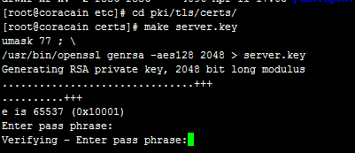

```
[root@test ~]#  cd /etc/pki/tls/certs/　 ← 进入HTTP服务器配置文件所在目录
[root@test certs]#  make server.key　 ← 建立服务器密钥
umask 77 ; \
               /usr/bin/openssl genrsa -des3 1024 > server.key
Generating RSA private key, 1024 bit long modulus
................++++++
......++++++
e is 65537 (0x10001)
Enter pass phrase:　                     ← 在这里输入口令
Verifying - Enter pass phrase:　  ← 确认口令，再次输入
```

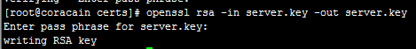

```
[root@test certs]#  openssl rsa -in server.key -out server.key　 ← 从密钥中删除密码（以避免系统启动后被询问口令）
Enter pass phrase for server.key:　 ← 输入口令
writing RSA key
```

第二步 建立服务器公钥

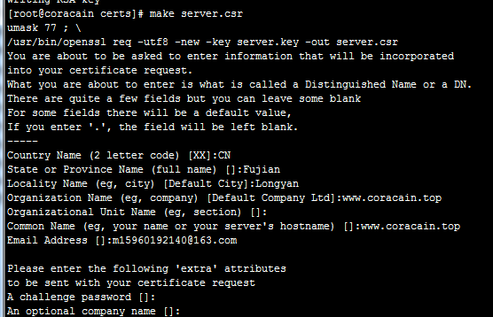

```
[root@test certs]#  make server.csr　 ← 建立服务器密钥
umask 77 ; \
                /usr/bin/openssl req -utf8 -new -key server.key -out server.csr
You are about to be asked to enter information that will be incorporated
into your certificate request.
What you are about to enter is what is called a Distinguished Name or a DN.
There are quite a few fields but you can leave some blank
For some fields there will be a default value,
If you enter '.', the field will be left blank.
-----
Country Name (2 letter code) [GB]:CN　 ← 输入国名
State or Province Name (full name) [Berkshire]:Fujian　 ← 输入省名
Locality Name (eg, city) [Newbury]:Longyan　 ← 输入城市名
Organization Name (eg, company) [My Company Ltd]:www.coracain.top　 ← 输入组织名（任意）
Organizational Unit Name (eg, section) []:　 ← 不输入，直接回车
Common Name (eg, your name or your server's hostname) []:www.coracain.top　 ← 输入通称（任意）
Email Address []:m15960192140@163.com 　 ← 输入电子邮箱地址 
Please enter the following 'extra' attributes
to be sent with your certificate request
A challenge password []:　 ← 不输入，直接回车
An optional company name []: 　 ← 不输入，直接回车
```

第三步 建立服务器证书

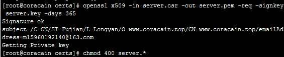

```
[root@test certs]#  openssl x509 -in server.csr -out server.pem -req -signkey server.key -days 365　 ← 建立服务器证书
Signature ok
subject=/C=CN/ST=Fujian/L=Longyan/O=www.coracain.top/CN=www.coracain.top/emailAddress=m15960192140@163.com
Getting Private key
[root@test certs]#  chmod 400 server.*    ← 修改权限为400
```

第四步 设置SSL

```
[root@test certs]#  vi /etc/httpd/conf.d/ssl.conf　 ← 修改SSL的设置文件
#DocumentRoot "/var/www/html"　 ← 找到这一行，将行首的“#”去掉
　↓
DocumentRoot "/var/www/html"　 ← 变为此状态
```

第五步 重新启动HTTP服务，让SSL生效

以上创建的https是不安全的，白白研究。。。

**注** make命令解析

```
make命令本身可带有四个参数：标志、宏定义、描述文件名和目标文件名。其标准形式为：
make [flags] [macro definitions] [targets]

Unix系统 标志位flags选项及其含义：
-f file　 指定file文件为描述文件，如果file参数为"-"符，那么描述文件指向标准输入。如果没有"-f"参数，则系统将默认当前目录下名为 makefile或者名为Makefile的文件为描述文件。在Linux中， GNU make 工具在当前工作目录中按照GNUmakefile、makefile、Makefile的顺序搜索 makefile文件。
-i 　　忽略命令执行返回的出错信息。 
-s 　　沉默模式，在执行之前不输出相应的命令行信息。 
-r 　　禁止使用build-in规则。 
-n 　　非执行模式，输出所有执行命令，但并不执行。 
-t 　　更新目标文件。 
-q　　 make操作将根据目标文件是否已经更新返回"0"或非"0"的状态信息。 
-p　　 输出所有宏定义和目标文件描述。 
-d　　 Debug模式，输出有关文件和检测时间的详细信息。

例如，要做出文件a.txt，就可以执行下面的命令
make a.txt
但是，如果你真的输入这条命令，它并不会起作用。因为Make命令本身并不知道，如何做出a.txt，需要有人告诉它，如何调用其他命令完成这个目标
比如，假设文件 a.txt 依赖于 b.txt 和 c.txt ，是后面两个文件连接（cat命令）的产物。那么，make 需要知道下面的规则
a.txt: b.txt c.txt
cat b.txt c.txt > a.txt
也就是说，make a.txt 这条命令的背后，实际上分成两步：第一步，确认 b.txt 和 c.txt 必须已经存在，第二步使用 cat 命令 将这个两个文件合并，输出为新文件。
像这样的规则，都写在一个叫做Makefile的文件中，Make命令依赖这个文件进行构建。Makefile文件也可以写为makefile， 或者用命令行参数指定为其他文件名。
$ make -f rules.txt
# 或者
$ make --file=rules.txt
上面代码指定make命令依据rules.txt文件中的规则，进行构建。

linux系统 稍有不同，以下只列出不同部分：
-c dir　　 在读取 makefile 之前改变到指定的目录dir。 
-I dir 　　当包含其他 makefile文件时，利用该选项指定搜索目录。 
-h 　　help文挡，显示所有的make选项。 
-w 　　在处理 makefile 之前和之后，都显示工作目录。

通过命令行参数中的target ，可指定make要编译的目标，并且允许同时定义编译多个目标，操作时按照从左向右的顺序依次编译target选项中指定的目标文件。如果命令行中没有指 定目标，则系统默认target指向描述文件中第一个目标文件。

1、makefile 

makefile定义了一系列的规则来指定，哪些文件需要先编译，哪些文件需要后编译，哪些文件需要重新编译，甚至于进行更复杂的功能操作，因为 makefile就像一个Shell脚本一样，其中也可以执行操作系统的命令。makefile带来的好处就是--“自动化编译”,一旦写好，只需要一个make命令，整个工程完全自动编译，极大的提高了软件开发的效率。
每条规则的形式如下:
<target> : <prerequisites> 
[tab] <commands>
上面第一行冒号前面的部分，叫做"目标"（target），冒号后面的部分叫做"前置条件"（prerequisites）；第二行必须由一个tab键起首，后面跟着"命令"（commands）。
"目标"是必需的，不可省略；"前置条件"和"命令"都是可选的，但是两者之中必须至少存在一个。
1.1 目标（target）
一个目标（target）就构成一条规则。目标通常是文件名，指明Make命令所要构建的对象，比如上文的 a.txt 。目标可以是一个文件名，也可以是多个文件名，之间用空格分隔。
除了文件名，目标还可以是某个操作的名字，这称为"伪目标"（phony target）。
clean:
rm *.o
上面代码的目标是clean，它不是文件名，而是一个操作的名字，属于"伪目标 "，作用是删除对象文件。
$ make clean
但是，如果当前目录中，正好有一个文件叫做clean，那么这个命令不会执行。因为Make发现clean文件已经存在，就认为没有必要重新构建了，就不会执行指定的rm命令。
为了避免这种情况，可以明确声明clean是"伪目标"，写法如下。
.PHONY: clean
clean:
rm *.o temp
声明clean是"伪目标"之后，make就不会去检查是否存在一个叫做clean的文件，而是每次运行都执行对应的命令。像.PHONY这样的内置目标名还有不少，可以查看手册。
如果Make命令运行时没有指定目标，默认会执行Makefile文件的第一个目标。
$ make
上面代码执行Makefile文件的第一个目标
2.2 前置条件（prerequisites）
前置条件通常是一组文件名，之间用空格分隔。它指定了"目标"是否重新构建的判断标准：只要有一个前置文件不存在，或者有过更新（前置文件的last-modification时间戳比目标的时间戳新），"目标"就需要重新构建。

2、make命令
make --根据makefile文件编译源代码、链接、生成目标文件、可执行文件
make clean --清除上次的make命令所产生的object文件（后缀为".o"的文件）及可执行文件
make install -- 将编译成功的可执行文件安装到系统目录中，一般为/usr/local/bin目录
make dist --产生发布软件包文件（即distribution package） 这个命令将会将可执行文件及相关文件打包还曾一个tar.gz压缩的文件用来作为发布软件的软件包。它会在当前目录下生成一个名字类似“PACKAGE-VERSION.tar.gz”的文件。PACKAGE和VERSION,是我们在configure.in中定义的AM_INIT_AUTOMAKE（PACKAGE, VERSION）。 
make distcheck --生成发布软件包并对其进行测试检查，以确定发布包的正确性。这个操作将自动把压缩包文件解开，然后执行configure命令，并且执行make,来确认编译不出现错误，最后提示你软件包已经准备好，可以发布了
make distclean --类似make clean,但同时也将configure生成的文件全部删除掉，包括Makefile文件
```

#### certbot 免费安全证书

##### 安装CertBot

```
sudo yum install epel-release
sudo yum install certbot
```

##### 配置nginx

使用webroot配置模式

因为，CertBot在验证服务器域名的时候，会生成一个随机文件，然后CertBot的服务器会通过HTTP访问你的这个文件，因此要确保你的Nginx配置好，以便可以访问到这个文件。

修改你的服务器配置，在`server模块`添加：

```
location ^~ /.well-known/acme-challenge/ {
   default_type "text/plain";
   root     /usr/share/nginx/html;
}

location = /.well-known/acme-challenge/ {
   return 404;
}
```

接下来执行：

```
sudo certbot certonly --webroot -w /usr/local/nginx/html/ -d coracain.top
```

但是报了

```
ImportError: 'pyOpenSSL' module missing required functionality. Try upgrading to v0.14 or newer. 
```

以下是解决思路

https://github.com/certbot/certbot/issues/5534

try `pip install --upgrade --force-reinstall 'requests==2.6.0'`

又报了一个错误。。

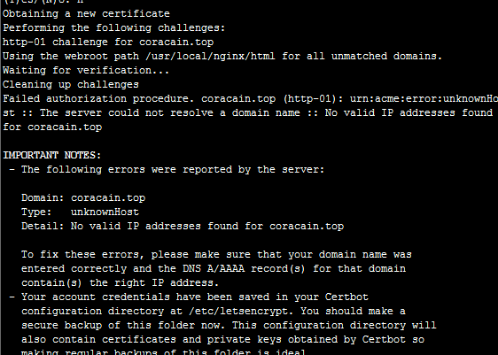

解决办法

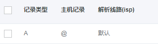

增加一个只对主域名做解析的dns配置

接下来成功了

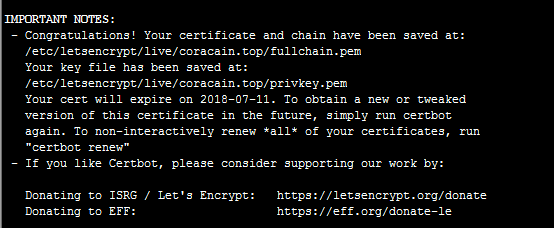

但在启动nginx时又报了异常

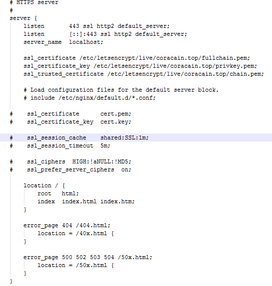

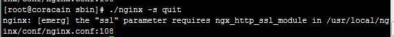

原因是：nginx缺少http_ssl_module模块，编译安装的时候带上--with-http_ssl_module配置就行了，但是现在的情况是nginx已经安装，需要添加模块

**注** nginx的安装目录是/usr/local/nginx

​	源码包在/home/cain/nginx-1.12.2

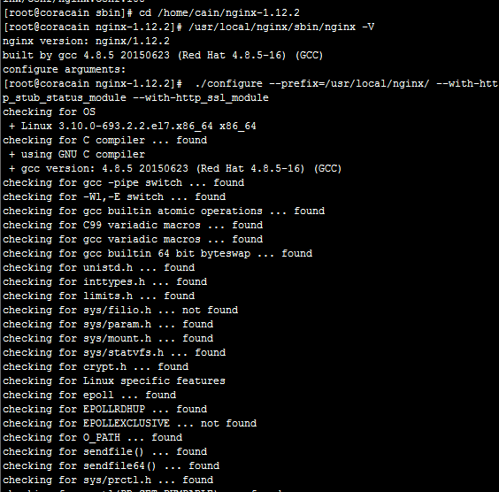

切换到源码包

> cd /home/cain/nginx-1.12.2

查看nginx原有的模块

> /usr/local/nginx/sbin/nginx -V

在configure arguments:后面显示的原有的configure参数如下：

> --prefix=/usr/local/nginx --with-http_stub_status_module

那么我们的新配置信息就应该这样写：

> [root@coracain nginx-1.12.2]#  ./configure --prefix=/usr/local/nginx/ --with-http_stub_status_module --with-http_ssl_module

运行上面的命令即可，等配置完

配置完成后，运行命令

> make

这里不要进行make install，否则就是覆盖安装

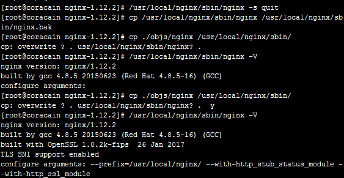

然后备份原有已安装好的nginx

> cp /usr/local/nginx/sbin/nginx /usr/local/nginx/sbin/nginx.bak

然后将刚刚编译好的nginx覆盖掉原有的nginx（这个时候nginx要停止状态）

> /usr/local/nginx/sbin/nginx -s quit
>
> [root@coracain nginx-1.12.2]# cp ./objs/nginx /usr/local/nginx/sbin/

然后启动nginx，仍可以通过命令查看是否已经加入成功

> /usr/local/nginx/sbin/nginx -V

##### certbot证书更新

由于certbot所使用的letsencrypt证书只有90天的有效期，所以我们需要对它定期自动更新。

首先模拟更新：

```
sudo certbot renew --dry-run

# 看到如下输出证明模拟更新成功
-------------------------------------------------------------------------------
Processing /etc/letsencrypt/renewal/your.domain.com.conf
-------------------------------------------------------------------------------
** DRY RUN: simulating 'certbot renew' close to cert expiry
**          (The test certificates below have not been saved.)

Congratulations, all renewals succeeded. The following certs have been renewed:
  /etc/letsencrypt/live/xxxx.com/fullchain.pem (success)
** DRY RUN: simulating 'certbot renew' close to cert expiry
**          (The test certificates above have not been saved.)
```

然后就可以使用`crontab -e`命令来实现自动化了：

```
sudo crontab -e

#添加配置，每周一半夜3点00分执行renew：

00 3 * * 1 /usr/bin/certbot renew  >> /var/log/le-renew.log
```

[]()

### nginx添加http/2支持

参照以上添加https http_ssl_module模块方式，添加http_v2_module模块，由于该模块同时需要ssl的支持，如果在没有添加http_ssl_module模块，要一并添加。

在./configure中加入: —with-http_v2_module，注意—with-http_ssl_module也要有