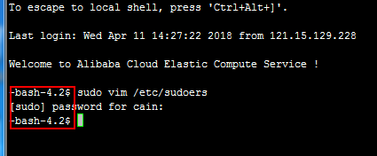
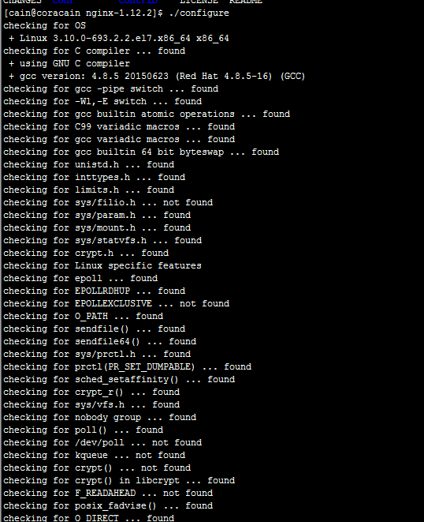
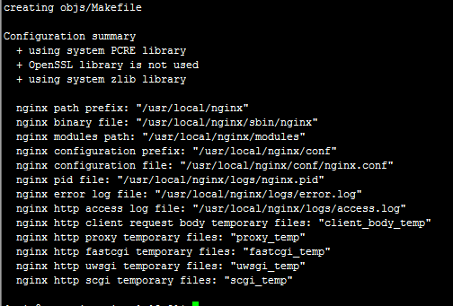
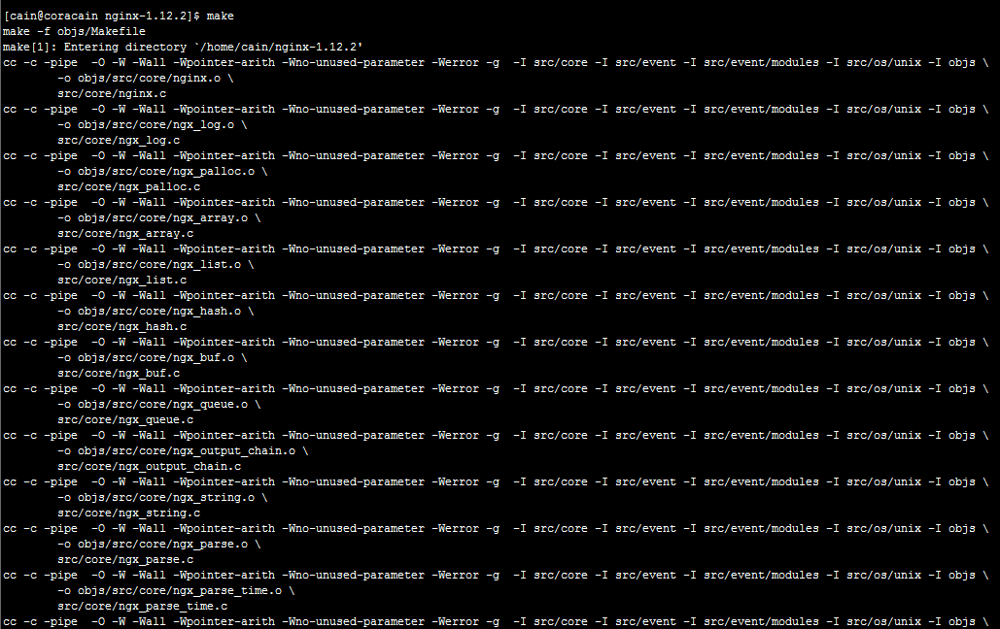
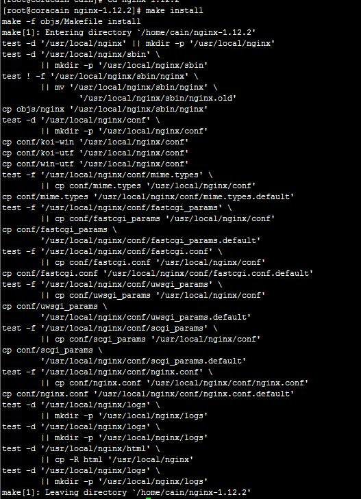
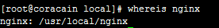
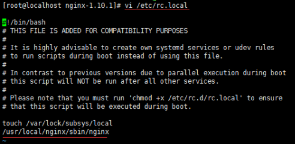

## 玩Centos服务器遇到的问题

### 文件夹的含义

/root

​    这是系统管理员(root user)的目录。对于系统来说，系统管理员就好比是上帝，它能对系统做任何事情，甚至包括删除你的文件。因此，请小心使用root帐号。

/bin

​    这里存放了标准的(或者说是缺省的)linux的工具，比如像“ls”、“vi”还有“more”等等。通常来说，这个目录已经包含在你的“path”系 统变量里面了。什么意思呢?就是：当你在终端里输入ls，系统就会去/bin目录下面查找是不是有ls这个程序。

/etc

​    这里主要存放了系统配置方面的文件。举个例子：你安装了samba这个套件，当你想要修改samba配置文件的时候，你会发现它们(配置文件)就在/etc/samba目录下。

 /dev

​    这里主要存放与设备(包括外设)有关的文件(unix和linux系统均把设备当成文件)。想连线打印机吗?系统就是从这个目录开始工作的。另外还有一些包括磁盘驱动、USB驱动等都放在这个目录。

 /home

​    这里主要存放你的个人数据。具体每个用户的设置文件，用户的桌面文件夹，还有用户的数据都放在这里。每个用户都有自己的用户目录，位置为：/home/用户名。当然，root用户除外。

 /usr

​    在这个目录下，你可以找到那些不适合放在/bin或/etc目录下的额外的工具。比如像游戏阿，一些打印工具拉等等。/usr目录包含了许多子目录： /usr/bin目录用于存放程序;/usr/share用于存放一些共享的数据，比如音乐文件或者图标等等;/usr/lib目录用于存放那些不能直接 运行的，但却是许多程序运行所必需的一些函数库文件。你的软件包管理器(应该是“新立得”吧)会自动帮你管理好/usr目录的。

/opt

​    这里主要存放那些可选的程序。你想尝试最新的firefox测试版吗?那就装到/opt目录下吧，这样，当你尝试完，想删掉firefox的时候，你就可 以直接删除它，而不影响系统其他任何设置。安装到/opt目录下的程序，它所有的数据、库文件等等都是放在同个目录下面。

​    举个例子：刚才装的测试版firefox，就可以装到/opt/firefox_beta目录下，/opt/firefox_beta目录下面就包含了运 行firefox所需要的所有文件、库、数据等等。要删除firefox的时候，你只需删除/opt/firefox_beta目录即可，非常简单。

/usr/local

​    这里主要存放那些手动安装的软件，即不是通过“新立得”或apt-get安装的软件。它和/usr目录具有相类似的目录结构。让软件包管理器来管理/usr目录，而把自定义的脚本(scripts)放到/usr/local目录下面，我想这应该是个不错的主意。

 /media

​    有些linux的发行版使用这个目录来挂载那些usb接口的移动硬盘(包括U盘)、CD/DVD驱动器等等。创建新用户

> useradd -d /home/cain -m cain

useradd 主要参数：

​	-c：加上备注文字，备注文字保存在passwd的备注栏中。

　　-d：指定用户登入时的主目录，替换系统默认值/home/<用户名>

　　-D：变更预设值。

　　-e：指定账号的失效日期，日期格式为MM/DD/YY，例如06/30/12。缺省表示永久有效。

　　-f：指定在密码过期后多少天即关闭该账号。如果为0账号立即被停用；如果为-1则账号一直可用。默认值为-1.

　　-g：指定用户所属的群组。值可以使组名也可以是GID。用户组必须已经存在的，期默认值为100，即users。

　　-G：指定用户所属的附加群组。

　　-m：自动建立用户的登入目录。

　　-M：不要自动建立用户的登入目录。

　　-n：取消建立以用户名称为名的群组。

　　-r：建立系统账号。

　　-s：指定用户登入后所使用的shell。默认值为/bin/bash。

　　-u：指定用户ID号。该值在系统中必须是唯一的。0~499默认是保留给系统用户账号使用的，所以该值必须大于499。

### rpm和yum的解释

> rpm是系统的软件管理程序，可以安装、卸载、查询已经下载的rpm包  rpm只能安装本地已经下载好的包
> yum是专用的在线安装软件，会联网查询，下载对应的包，然后安装（安装过程应该也是调用rpm装的，具体没了解过）

### 创建新用户密码

>sudo passwd cain

### 赋予新用户sudo权限

在centos中可能会出现

```
usermod: group 'sudo' does not exist
```

因为centos默认没有sudo组，可以讲用户指向wheel用户组，wheel用户组同样有sudo权限

所以在centos上可以使用如下命令添加用户组

> sudo usermod -a -G wheel cain

或

echo "comtop       ALL=(ALL)       NOPASSWD: ALL" >>/etc/sudoers  该命令将该用户添加为管理员

**注** 当在非root管理员下 要执行普通用户不能做的事时，要用sudo -i命令切换为管理员，此时才能执行，如修改系统配置的时候

### ssh中新增加用户没有显示用户名




原因是  创建用户的时候，手动把目录给删了  重新添加了目录，导致默认配置信息被修改后，显示不了

### 安装nodejs

#### 首先安装wget

> yum install -y wget

#### 下载最新的nodejs的bin包

> wget https://nodejs.org/dist/v9.11.1/node-v9.11.1-linux-x64.tar.xz

#### 解压包

依次执行

>xz -d node-v9.11.1-linux-x64.tar.xz
>tar -xf node-v9.11.1-linux-x64.tar

##### xz压缩文件方法或命令

xz -z 要压缩的文件

如果要保留被压缩的文件加上参数 -k ，如果要设置压缩率加入参数 -0 到 -9调节压缩率。如果不设置，默认压缩等级是6.

##### xz解压文件方法或命令

xz -d 要解压的文件

同样使用 -k 参数来保留被解压缩的文件

##### 创建tar.xz文件

先tar cvf xxx.tar xxx/这样创建xxx.tar文件先，然后使用xz -z xxx.tar 将xxx.tar压缩成为xxx.tar.xz

##### 解压tar.xz文件

先xz -d xxx.tar.xz 将xxx.tar.xz解压成xxx.tar 然后，再用tar xvf xxx.tar解包

###### tar命令参数

> 打包： tar -cf soft.tar soft
>
> **解包： tar -xf soft.tar soft**
>
> **压缩目录**
>
> **打包压缩：tar czvf usr.tar.gz /home**
>
> 解压缩：tar xzvf usr.tar.gz
>
> **压缩文件（对于目录失效）**
>
> **压缩：zip good.zip good1 good2**
>
> 解压：unzip good.zip

>z：使用gz压缩格式 gz=gunzip；使用deflate压缩算法，LZ77算法的进化版，Philip Katz（作者），所有的zip格式都使用这种算法
>
>x：解包
>
>c：打包
>
>v：显示过程
>
>f= --file：后面指定包的文件名

#### 部署bin文件

依次执行

>ln -s /home/cain/node-v9.11.1-linux-x64/bin/node /usr/bin/node
>
>ln -s /home/cain/node-v9.11.1-linux-x64/bin/npm /usr/bin/npm

ln指令用于创建关联（类似于windows的快捷方式）必须给全路径，否则可能关联错误

### 安装mysql

#### 下载mysql的repo源

> wget http://repo.mysql.com/mysql-community-release-el7-5.noarch.rpm

##### rpm

###### 安装rpm

> rpm -ivh ***.rpm 
>
> 其中i表示安装，v表示显示安装过程，h表示显示进度

###### 升级rpm包

> rpm -Uvh ***.rpm

###### 删除软件包

> rpm -e PACKAGE_NAME
>
> rpm -e -nodeps PACKAGE_NAME # 不考虑依赖包
>
> rpm -e -allmatches PACKAGE_NAME # 删除所有跟PACKAGE_NAME匹配的所有版本的包

#### 安装mysql-community-release-el7-5.noarch.rpm包

> sudo rpm -ivh mysql-community-release-el7-5.noarch.rpm

安装这个包后，会获得两个mysql的yum repo源：/etc/yum.repos.d/mysql-community.repo，/etc/yum.repos.d/mysql-community-source.repo。

#### 安装mysql

> sudo yum install mysql-server

##### 如何查看mysql安装目录？

方法一：通过rpm查看

###### 查看软件是否安装

> rpm -qa | grep mysql

根据rpm -ql 列出软件包安装的文件

> rpm -ql mysql-community-client-5.6.39-2.el7.x86_64

###### 综合上述命令，可以直接使用以下命令查看存储位置

> rpm -qal | grep mysql

方法二：

which查找命令

>which mysql

方法三：

find命令查找

> find / -name mysql

方法四：

whereis命令 该命令和find类似

>whereis mysql

注：whereis是通过本地架构好的数据库索引查找会比较快。如果没有更新到数据库里面的文件或命令则无法查找到信息

##### 重置mysql密码

> mysql -u root

登录时有可能报这样的错：ERROR 2002 (HY000): Can‘t connect to local MySQL server through socket ‘/var/lib/mysql/mysql.sock‘ (2)，原因是/var/lib/mysql的访问权限问题。下面的命令把/var/lib/mysql的拥有者改为当前用户：

> sudo chown -R root:root /var/lib/mysql

##### 重启mysql服务

> service mysqld restart

##### 登陆重置密码

>mysql -u root  //直接回车进入mysql控制台
>mysql > use mysql;
>mysql > update user set password=password('123456') where user='root';
>mysql > exit;

#### 安装nginx

##### gcc安装

安装 nginx 需要先将官网下载的源码进行编译，编译依赖 gcc 环境，如果没有 gcc 环境，则需要安装：

```
yum install gcc-c++
```

##### PCRE pcre-devel安装

PCRE(Perl Compatible Regular Expressions) 是一个Perl库，包括 perl 兼容的正则表达式库。nginx 的 http 模块使用 pcre 来解析正则表达式，所以需要在 linux 上安装 pcre 库，pcre-devel 是使用 pcre 开发的一个二次开发库。nginx也需要此库。命令：

```
yum install -y pcre pcre-devel
```

##### zlib安装

zlib 库提供了很多种压缩和解压缩的方式， nginx 使用 zlib 对 http 包的内容进行 gzip ，所以需要在 Centos 上安装 zlib 库。

```
yum install -y zlib zlib-devel
```

##### OpenSSL安装

OpenSSL 是一个强大的安全套接字层密码库，囊括主要的密码算法、常用的密钥和证书封装管理功能及 SSL 协议，并提供丰富的应用程序供测试或其它目的使用。
nginx 不仅支持 http 协议，还支持 https（即在ssl协议上传输http），所以需要在 Centos 安装 OpenSSL 库。

```
yum install -y openssl openssl-devel
```

##### 下载nginx

>```
>wget -c https://nginx.org/download/nginx-1.12.2.tar.gz
>```

##### 解压nginx

> ```
> tar -zxvf nginx-1.10.1.tar.gz
> cd nginx-1.10.1
> ```

##### 配置

使用默认配置

> ./configure





第二步

> make



第三步

> make install



第四步，检查安装路径

> whereis nginx



##### 启动、停止nginx

```
cd /usr/local/nginx/sbin/
./nginx 
./nginx -s stop
./nginx -s quit
./nginx -s reload
```

> `./nginx -s quit`:此方式停止步骤是待nginx进程处理任务完毕进行停止。
> `./nginx -s stop`:此方式相当于先查出nginx进程id再使用kill命令强制杀掉进程。

查询nginx进程：

```
ps aux|grep nginx
```

##### 重启nginx

1.先停止再启动（推荐）：
对 nginx 进行重启相当于先停止再启动，即先执行停止命令再执行启动命令。如下：

```
./nginx -s quit
./nginx
```

2.重新加载配置文件：
当 ngin x的配置文件 nginx.conf 修改后，要想让配置生效需要重启 nginx，使用`-s reload`不用先停止 ngin x再启动 nginx 即可将配置信息在 nginx 中生效，如下：
./nginx -s reload

启动成功后，在浏览器可以看到这样的页面：

##### 开机自启动

即在`rc.local`增加启动代码就可以了。

```
vi /etc/rc.local
```

增加一行 `/usr/local/nginx/sbin/nginx`
设置执行权限：

```
chmod 755 rc.local
```

