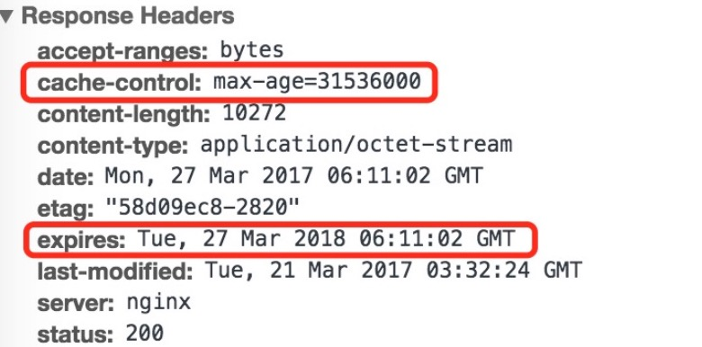
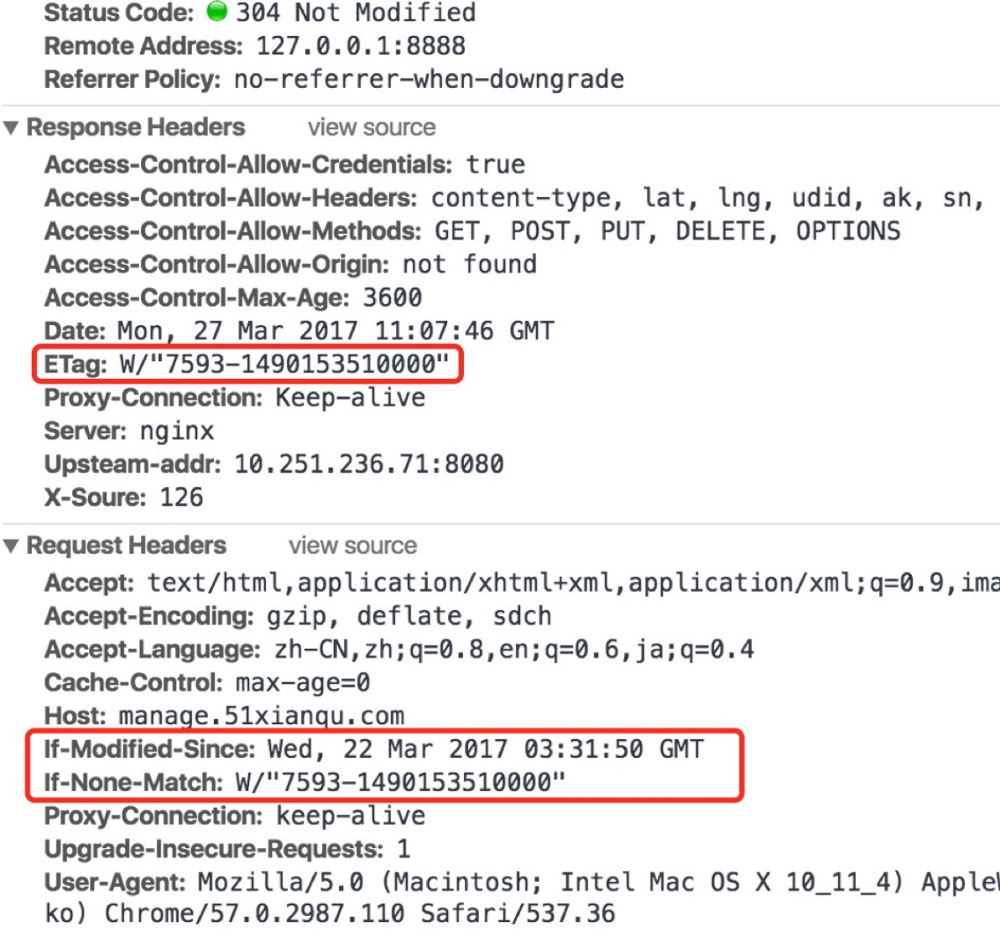
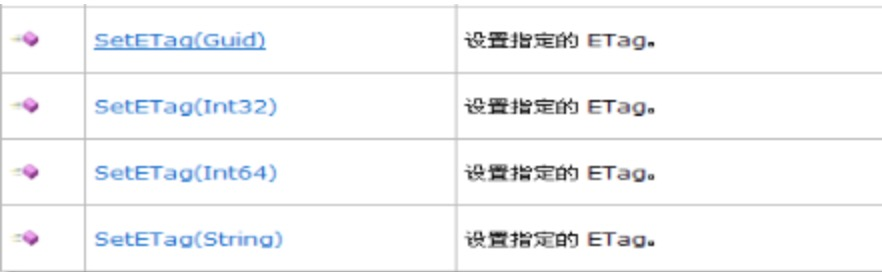

## 浏览器缓存梳理

### 缓存分类

1. 强缓存
2. 协商缓存

他们的匹配流程：

1. 浏览器发送请求前，根据请求头的expires和cache-control判断是否命中强缓存策略，如果命中，直接从缓存获取资源，并不会发送请求。如果没有命中，进入下一步。
2. 没有命中强缓存规则，浏览器会发送请求，根据请求头的last-modified和etag判断是否命中协商缓存，如果命中，直接从缓存中获取资源。如果没有命中，进入下一步。
3. 如果前两步没有命中，直接从服务端获取资源。

### 详述

- 强缓存

#### 原理

强缓存需要服务端设置expires和cache-control

nginx代码参考，设置一年的缓存时间：

```
location ~ .*\.(ico|svg|ttf|eot|woff)(.*) {
  proxy_cache               pnc;
  proxy_cache_valid         200 304 1y;
  proxy_cache_valid         any 1m;
  proxy_cache_lock          on;
  proxy_cache_lock_timeout  5s;
  proxy_cache_use_stale     updating error timeout invalid_header http_500 http_502;
  expires                   1y;
}
```



（1）expires（**http1.0**）：从图可以看出，expires的值是一个绝对时间，是http1.0的功能。如果浏览器的时间没有超过这个expires的时间，代表缓存还有效，命中强缓存，直接从缓存读取资源。不过由于存在浏览器和服务端时间可能出现较大误差，所以在之后http1.1提出了cache-control。

（2）cache-control(**http1.1**)：从图可以看出，cache-control的值是类似于`max-age=31536000`这样的，是一个相对时间，31536000是秒数，正好是一年的时间。当浏览器第一次请求资源的时候，会把response header的内容缓存下来。之后的请求会先从缓存检查该response header，通过第一次请求的date和cache-control计算出缓存有效时间。如果浏览器的时间没有超过这个缓存有效的时间，代表缓存还有效，命中强缓存，直接从缓存读取资源。

> 两者可以同时设置，但是优先级cache-control>expires

#### from disk cache（磁盘缓存）和from memory cache（内存缓存）

> Chrome employs two caches — an on-disk cache and a very fast in-memory cache. The lifetime of an in-memory cache is attached to the lifetime of a render process, which roughly corresponds to a tab. Requests that are answered from the in-memory cache are invisible to the web request API. If a request handler changes its behavior (for example, the behavior according to which requests are blocked), a simple page refresh might not respect this changed behavior. To make sure the behavior change goes through, call handlerBehaviorChanged() to flush the in-memory cache. But don't do it often; flushing the cache is a very expensive operation. You don't need to call handlerBehaviorChanged() after registering or unregistering an event listener.

- memory cache简介

MemoryCache顾名思义，就是将**资源缓存到内存**中，等待下次访问时不需要重新下载资源，而直接从内存中获取。Webkit早已支持memoryCache。  目前Webkit资源分成两类，一类是**主资源**，比如HTML页面，或者下载项，一类是**派生资源**，比如HTML页面中内嵌的图片或者脚本链接，分别对应代码中两个类：MainResourceLoader和SubresourceLoader。虽然**Webkit支持memoryCache，但是也只是针对派生资源**，它对应的类为CachedResource，用于**保存原始数据（比如CSS，JS等），以及解码过的图片数据**。

- disk cache简介

diskCache顾名思义，就是将**资源缓存到磁盘**中，等待下次访问时不需要重新下载资源，而直接从磁盘中获取，它的直接操作对象为CurlCacheManager。它与memoryCache**最大的区别**在于，**当退出进程时，内存中的数据会被清空，而磁盘的数据不会**，所以，当下次再进入该进程时，该进程仍可以从diskCache中获得数据，而memoryCache则不行。

diskCache与memoryCache**相似之处**就是也**只能存储一些派生类资源文件**。它的存储形式为一个index.dat文件，**记录存储数据的url**，然后**再分别存储该url的response信息和content内容**。Response信息最大作用就是用于判断服务器上该url的content内容是否被修改。

在命中强缓存的情况下，进程初次渲染会从磁盘读取缓存资源。chrome会将部分资源保存在内存中。

由于内存缓存是直接从内存中读取的，所以速度更快。而磁盘缓存需要从磁盘中读取，速度还和磁盘的I/O有关，时间大概在2~10ms，也是相当快的。

#### 强缓存作用

强缓存作为性能优化中缓存方面最有效的手段，能够极大的提高性能。由于强缓存不会向服务端发送请求，对服务端的压力也是大大减小。

对于一些不太经常变更的资源，可以设置一个超长时间的缓存时间，比如一年。

但是由于不会向服务端发送请求，那么如果资源有更改的时候，解决方法是加一个?v=xx的后缀，在更新静态资源版本的时候，更新v值，相当于向服务端发起一个新的请求，从而达到更新静态资源的目的。

#### 三级缓存原理

1. 先去内存看，如果有，命中
2. 若内存没有，择取硬盘获取，如果有命中
3. 若硬盘没有，那么就进行网络请求
4. 加载到的资源缓存到硬盘和内存

因此，有以下几种现象

1. 访问->200->退出浏览器

​	再进入->200（from disk cache）->刷新->200(from memory cache)

​	总结：似乎chrome可以判断既然已经从disk拿了，第二次就内存里拿

2. 图片、base64都是from memory cache

   总结：解析渲染图片直接就放在内存，用的时候直接拿

3. js、css为例，都是直接disk cache

   总结：似乎太占位置，直接就放硬盘得了

4. 隐私模式下，几乎都是from memory cache

   总结：隐私模式，不能暴露，那就放在内存中

### 协商缓存

#### 原理

在强缓存没有命中的时候，就会触发协商缓存。协商缓存会根据**[last-modified/if-modified-since]**或者**[etag/if-none-match]**来进行判断缓存是否过期。

nginx代码参考：

```
location ~ .*\.(ico|svg|ttf|eot|woff)(.*) {
  proxy_cache               pnc;
  proxy_cache_valid         200 304 1y;
  proxy_cache_valid         any 1m;
  proxy_cache_lock          on;
  proxy_cache_lock_timeout  5s;
  proxy_cache_use_stale     updating error timeout invalid_header http_500 http_502;
  etag                                       on;
}
```



（1）last-modified/if-modified-since：浏览器**首先发送一个请求，让服务端在response header 中返回请求的资源带上上次更新时间，就是last-modified，浏览器会缓存下这个时间**。然后浏览器在下次请求中，request header中带上if-modified-since**[保存的last-modified值]**。根据浏览器发送的修改时间和服务端的修改时间进行对比，一致代表资源没有改变，服务端返回正文为空的响应，让浏览器的缓存中读取资源，大大减小了请求的耗时。由于**last-modified依赖的是保存的绝对时间，还是会出现误差的情况**：一是保存的时间是以秒为单位的，1秒内多次修改是无法捕捉到的；二是各机器读取到的时间不一致，就有出现误差的可能性。为了改善这个问题，提出了使用Etag。

（2）etag/if-none-match:etag是http协议提供的若干机制中的一种web缓存验证机制，并且允许客户端进行缓存协商。生成etag常用的方法包括**对资源内容使用抗碰撞散列函数**、**使用最近修改的时间戳的哈希值**，甚至**只是一个版本号**。和last-modified一样，浏览器会先发送一个请求得到etag的值，然后再下一次请求在request header 中带上if-none-match[保存的etag值]。通过发送的etag的值和服务端重新生成的etag的值进行比对，如果一直代表资源没有改变，服务端返回正文为空的响应，告诉浏览器从缓存中读取资源。

> Etag值是由服务端计算生成，并在相应客户端请求时将它返回给客户端。
>
> http1.1协议中并没有规范如何计算Etag。Etag值可以是唯一标识资源的任何东西，如持久化存储中的某个资源关联的版本、一个或多个文件属性、实体头信息和校验值、（CheckSum），也可以计算实体信息的散列值。有时候为了计算一个Etag值可能有比较大的代价，此时可以采用生成唯一值等方式（如常见的GUID）。客户端不用关心Etag值如何产生，只要服务在资源状态发生变更的情况下将Etag值发送给它。
>
> 在MSDN中，OutgoingResponse类中设置Etag值：
>
> 
>
> 在上图可以看出，在REST架构下，Etag值可以通过Guid，整数，长整数，字符串四种类型的参数传入SetETag方法。另外OutgoingResponse类也有字符串属性：ETag直接给它赋值也能在HTTP响应头中写入ETag值。

**etag能解决last-modified的一些缺点，但是etag每次服务端生成都需要进行读写操作，而last-modified只需要读取操作**，从而etag的消耗是更大的。

#### 协商缓存作用

协商缓存是无法减少请求数的开销的，但是可以减少返回的正文大小。一般来说，**对于改变频繁的html文件，使用协商缓存是一种不错的选择**。

### 刷新缓存方法

刷新**强缓存**可以使用**?v=xxx**

刷新**协商缓存**可以直接**修改文件内容**


